# Developing CipherStash EQL

## Table of Contents

- [How this project is organised](#how-this-project-is-organised)
- [Set up a local development environment](#set-up-a-local-development-environment)
  - [Installing mise](#installing-mise)
- [Testing](#testing)
  - [Running tests locally](#running-tests-locally)
- [Releasing](#releasing)
- [Building](#building)
  - [Dependencies](#dependencies)
  - [Building a release locally](#building-a-release-locally)
- [Structure](#structure)
  - [Schema](#schema)
  - [Types](#types)
    - [Encrypted column type](#encrypted-column-type)
    - [Encrypted index term types](#encrypted-index-term-types)
  - [Operators](#operators)
    - [Working without operators](#working-without-operators)
  - [Configuration table](#configuration-table)

### How this project is organised

Development is managed through [mise](https://mise.jdx.dev/), both locally and [in CI](https://github.com/cipherstash/encrypt-query-language/actions).

mise has tasks for:

- Building EQL install and uninstall scripts (`build`)
- Starting and stopping PostgreSQL containers (`postgres:up`, `postgres:down`)
- Running unit and integration tests (`test`, `reset`)

These are the important files in the repo:

```
.
├── mise.toml              <-- the main config file for mise
├── tasks/                 <-- mise tasks
├── src/                   <-- The individual SQL components that make up EQL
│   ├── blake3/            <-- blake3 index term type
│   ├── encrypted/         <-- Encrypted column type
│   ├── operators/         <-- Operators for the encrypted column type
│   ├── match/             <-- match index term type
│   ├── unique/            <-- unique index term type
│   ├── ore/               <-- ore index term type
│   ├── ore_cllw_u64_8/    <-- ore-cllw fixed index term type
│   ├── ore_cllw_var_8/    <-- ore-cllw variable index term type
│   ├── config/            <-- Configuration management for encrypted columns
│   ├── schema.sql         <-- Defines the PostgreSQL schema for namespacing EQL
│   ├── crypto.sql         <-- Installs pg_crypto extension, required by ORE
│   ├── common.sql         <-- Shared helper functions
│   └── version.sql        <-- Defines function to query current EQL version - automatically generated on build
├── docs/                  <-- Tutorial, reference, and concept documentation
├── tests/                 <-- Unit and integration tests
│   ├── docker-compose.yml <-- Docker configuration for running PostgreSQL instances
│   └── *.sql              <-- Helpers and test data loaded during test runs
├── release/               <-- Build artifacts produced by the `build` task
├── examples/              <-- Example uses of EQL in different languages
└── playground/            <-- Playground enviroment for experimenting with EQL and CipherStash Proxy
```

Tests live alongside the individual SQL files, with a filename ending with `_test.sql`

We break SQL into small modules named after what they do.

In general, operator functions are thin wrappers around larger functions that do the actual work.
Put the wrapper functions in `operators.sql` and the larger functions in `functions.sql`.

Dependencies between SQL in `src/` are declared in a comment at the top of each file.
All SQL files should `REQUIRE` the source file of any other object they reference.

All files must have at least one declaration, and the default is to reference the schema:

```
-- REQUIRE: src/schema.sql
```

## Set up a local development environment

> [!IMPORTANT] > **Before you follow this how-to** you need to have this software installed:
>
> - [mise](https://mise.jdx.dev/) — see the [installing mise](#installing-mise) instructions
> - [Docker](https://www.docker.com/) — see Docker's [documentation for installing](https://docs.docker.com/get-started/get-docker/)

Local development quickstart:

```shell
# Clone the repo
git clone https://github.com/cipherstash/encrypt-query-language
cd encrypt-query-language

# Install dependencies
mise trust --yes

# Build EQL installer and uninstaller, outputting to release/
mise run build

# Start a postgres instance (defaults to PostgreSQL 17)
mise run postgres:up --extra-args "--detach --wait"

# Run the tests (defaults to PostgreSQL 17)
mise run test

# Stop and remove all containers and networks
mise run postgres:down
```

### Installing mise

> [!IMPORTANT]
> You must complete this step to set up a local development environment.

Local development and task running in CI is managed through [mise](https://mise.jdx.dev/).

To install mise:

- If you're on macOS, run `brew install mise`
- If you're on another platform, check out the mise [installation methods documentation](https://mise.jdx.dev/installing-mise.html#installation-methods)

Then add mise to your shell:

```shell
# If you're running Bash
echo 'eval "$(mise activate bash)"' >> ~/.bashrc

# If you're running Zsh
echo 'eval "$(mise activate zsh)"' >> ~/.zshrc
```

We use [`cargo-binstall`](https://github.com/cargo-bins/cargo-binstall) for faster installation of tools installed via `mise` and Cargo.
We install `cargo-binstall` via `mise` when installing development and testing dependencies.

> [!TIP]
> We provide abbreviations for most of the commands that follow.
> For example, `mise run postgres:setup` can be abbreviated to `mise r s`.
> Run `mise tasks --extended` to see the task shortcuts.

## Testing

There are tests for checking EQL against PostgreSQL versions 14–17, that verify:

- Adding, removing, and modifying encrypted data and indexes
- Validating, applying, and removing configuration for encrypted data and encrypted indexes
- Validating schemas for EQL configuration, encrypted data, and encrypted indexes
- Using PostgreSQL operators on encrypted data and indexes (`=`, `<>`, `@>`)

The easiest way to run the tests [is in GitHub Actions](./.github/workflows/test-eql.yml):

- Automatically whenever there are changes in the `sql/`, `tests/`, or `tasks/` directories
- By manually running [the workflow](https://github.com/cipherstash/encrypt-query-language/actions/workflows/test-eql.yml)

This is how the `test-eql.yml` workflow functions:

```mermaid
---
title: Testing EQL
---
stateDiagram-v2
    direction LR
    classDef code font-family:monospace;


    state "🧍 Human makes changes to EQL sources" as changes
    state sources_fork <<fork>>
    state sources_join <<join>>
    state "src/*.sql" as source_sql
    state "tasks/**/*" as source_tasks
    state "tests/**/*" as source_tests
    state sources_changed <<choice>>

    state "🛠️ Trigger GitHub Actions workflow test-eql.yml" as build_triggered
    state "Matrix: Test EQL SQL components" as matrix
    state "Test with Postgres 14" as pg14
    state "Test with Postgres 15" as pg15
    state "Test with Postgres 16" as pg16
    state "Test with Postgres 17" as pg17
    state "Check build results" as check
    state if_state <<choice>>

    changes --> sources_fork
    sources_fork --> source_sql:::code
    sources_fork --> source_tests:::code
    sources_fork --> source_tasks:::code
    source_sql --> sources_join
    source_tests --> sources_join
    source_tasks --> sources_join
    sources_join --> source_changed_check
    source_changed_check --> sources_changed
    sources_changed --> build_triggered : Some changes
    sources_changed --> [*]: No changes

    state "Check source changes" as source_changed_check

    [*] --> changes

    build_triggered --> matrix

    state fork_state <<fork>>
        matrix --> fork_state
        fork_state --> pg14
        fork_state --> pg15
        fork_state --> pg16
        fork_state --> pg17

    state join_state <<join>>
        pg14 --> join_state
        pg15 --> join_state
        pg16 --> join_state
        pg17 --> join_state

    state "✅ Pass build" as build_pass
    state "❌ Fail build" as build_fail
    join_state --> check
    check --> if_state
    if_state --> build_pass: All success
    if_state --> build_fail : Any failures
    build_pass --> [*]
    build_fail --> [*]
```



You can also [run the tests locally](#running-tests-locally) when doing local development.

### Running tests locally

> [!IMPORTANT] > **Before you run the tests locally** you need to [set up a local dev environment](#set-up-a-local-development-environment).

To run tests locally with PostgreSQL 17:

```shell
# Start a postgres instance (defaults to PostgreSQL 17)
mise run postgres:up --extra-args "--detach --wait"

# Run the tests (defaults to PostgreSQL 17)
mise run test

# Stop and remove all containers and networks
mise run postgres:down
```

You can run the same tasks for Postgres 14, 15, 16, and 17 by specifying arguments:

```shell
# Start a postgres 14 instance
mise run postgres:up postgres-14 --extra-args "--detach --wait"

# Run the tests against postgres 14
mise run test --postgres 14

# Stop postgres and remove all containers and networks
mise run postgres:down
```

The configuration for the Postgres containers in `tests/docker-compose.yml`.

Limitations:

- **Volumes for Postgres containers are not persistent.**
  If you need to look at data in the container, uncomment a volume in
  `tests/docker-compose.yml`
- **You can't run multiple Postgres containers at the same time.**
  All the containers bind to the same port (`7543`). If you want to run
  multiple containers at the same time, you have to change the ports by
  editing `tests/docker-compose.yml`

## Releasing

To cut a [release](https://github.com/cipherstash/encrypt-query-language/releases) of EQL:

1. Draft a [new release](https://github.com/cipherstash/encrypt-query-language/releases/new) on GitHub.
1. Choose a tag, and create a new one with the prefix `eql-` followed by a [semver](https://semver.org/) (for example, `eql-1.2.3`).
1. Generate the release notes.
1. Optionally set the release to be the latest (you can set a release to be latest later on if you are testing out a release first).
1. Click `Publish release`.

This will trigger the [Release EQL](https://github.com/cipherstash/encrypt-query-language/actions/workflows/release-eql.yml) workflow, which will build and attach artifacts to [the release](https://github.com/cipherstash/encrypt-query-language/releases/).

#### Public documentation updates

When a tag with the `eql-` prefix is pushed (for example, `eql-1.2.3`), the workflow at `.github/workflows/rebuild-docs.yml` runs and sends a webhook to our Vercel-hosted public docs site to trigger a rebuild.

What happens end-to-end:

- Release EQL builds EQL artifacts and generates API docs (HTML, XML, Markdown). The Markdown frontmatter includes the release version.
- Rebuild Docs posts to the `DOCS_WEBHOOK_URL` secret, which Vercel uses to kick off a fresh build of the public docs.
- The public docs site pulls the latest generated reference (`docs/api/markdown/API.md`) and publishes it under the corresponding version.

Manual triggers and troubleshooting:

- You can re-run the “Rebuild Docs” workflow from the Actions tab if a build fails downstream.
- Ensure the repository secret `DOCS_WEBHOOK_URL` is set and valid; the workflow simply POSTs to that URL.

This mirrors the process used in the sibling `protect` repository so both products’ documentation stay in sync with releases.

### dbdev

We publish a Trusted Language Extension for PostgreSQL for use on [dbdev](https://database.dev/).
You can find the extension on [dbdev's extension catalog](https://database.dev/cipherstash/eql).

#### Publishing to dbdev

**DISCLAIMER:** At the moment, we are manually publishing the extension to dbdev and the versions might not be in sync with the releases on GitHub until we automate this process.

Steps to publish

> [!NOTE]
> Make sure you have the [dbdev CLI](https://supabase.github.io/dbdev/cli/) installed and logged in using the `dbdev shared token` in 1Password.

1. Run `mise run build` to build the extension which will create the following file in the `dbdev` directory. (Note: this release artifact is built from the Supabase release artifact).
2. After the build is complete, you will have a file in the `dbdev` directory called `eql--0.0.0.sql`.
3. Update the file name from `eql--0.0.0.sql` replacing `0.0.0` with the version number of the release.
4. Also update the `eql.control` file with the new version number.
5. Run `dbdev publish` to publish the extension to dbdev.

Reach out to @calvinbrewer if you need help.

## Building

### Dependencies

SQL sources are split into smaller files in `src/`.
Dependencies are resolved at build time to construct a single SQL file with the correct ordering.

### Building a release locally

To build a release locally, run:

```bash
mise run build
```

This produces two SQL files in `releases/`:

- An installer (`cipherstash-encrypt.sql`), and
- An uninstaller (`cipherstash-encrypt-uninstall.sql`)

## Structure

### Adding SQL

When adding new SQL files to the project, follow these guidelines:

- Never drop the configuration table as it may contain customer data and needs to live across EQL versions
- Everything else should have a `DROP IF EXISTS`
- Functions should be `DROP` and `CREATE`, instead of `CREATE OR REPLACE`
  - Data types cannot be changed once created, so dropping first is more flexible
- Keep `DROP` and `CREATE` together in the code
- Types need to be dropped last, add to the `666-drop_types.sql`

### Schema

EQL is installed into the `eql_v2` PostgreSQL schema.

### Types

#### Encrypted column type

`public.eql_v2_encrypted` is EQL's encrypted column type, defined as PostgreSQL composite type.

This column type is used for storing the encrypted value and any associated indexes for searching.
The associated indexes are described in the [index term types](#index-term-types) section.

`public.eql_v2_encrypted` is in the public schema, because once it's used by a user in one of their tables, encrypted column types cannot be dropped without dropping data.

#### Encrypted index term types

Each type of encrypted index (`unique`, `match`, `ore`) has an associated type, functions, and operators.

These are transient runtime types, used internally by EQL functions and operators:

- `eql_v2.blake3`
- `eql_v2.hmac_256`
- `eql_v2.bloom_filter`
- `eql_v2.ore_cllw_u64_8`
- `eql_v2.ore_cllw_var_8`
- `eql_v2.ore_block_u64_8_256`
- `eql_v2.ore_block_u64_8_256_term`

The data in the column is converted into these types, when any operations are being performed on that encrypted data.

### Operators

Searchable encryption functionality is driven by operators on two types:

- EQL's `eql_v2_encrypted` column type
- PostgreSQL's `jsonb` column type

For convenience, operators allow comparisons between `eql_v2_encrypted` and `jsonb` column types.

Operators allow comparisons between:

- `eql_v2_encrypted` and `eql_v2_encrypted`
- `jsonb` and `eql_v2_encrypted`
- `eql_v2_encrypted` and `jsonb`

Operators defined on the `eql_v2_encrypted` dispatch to the underlying index terms based on the most efficient order of operations.

For example, it is possible to have both `unique` and `ore` indexes defined.
For equality (`=`, `<>`) operations, a `unique` index term is a text comparison and should be preferred over an `ore` index term.

The index term types and functions are internal implementation details and should not be exposed as operators on the `eql_v2_encrypted` type.
For example, `eql_v2_encrypted` should not have an operator with the `ore_block_u64_8_256` type.
Users should never need to think about or interact with EQL internals.

#### Working without operators

There are scenarios where users are unable to install EQL operators in your database.
Users will experience this in more restrictive environments like Supabase.

EQL can still be used, but requires the use of functions instead of operators.

For example, to perform an equality query:

```sql
SELECT email FROM users WHERE eql_v2.eq(email, $1);
```

### Configuration table

EQL uses a table for tracking configuration state in the database, called `public.eql_v2_configuration`.

This table should never be dropped, except by a user explicitly uninstalling EQL.

<!--
TODO(toby): probably move to README
TODO(toby): include examples of how to get data out of the table

EQL Design Note
Experimenting with using a Composite type instead of a Domain type for the encrypted column.
Composite types are a bit more capable. Domain types are more like an alias for the underlying type (in this case jsonb)
The consequence of using a Composite type is that the data is stored in the column as a Tuple - effectively the data is wrapped in ()
This means
on insert/update the data needs to be cast to eql_v2_encrypted (proxy mapping will handle)
on read the data needs to be cast back to jsonb if a customer needs the raw json (for data lake transfer etc etc)
Already built cast helpers so syntax is something like
    INSERT INTO encrypted (e) VALUES (
        eql_v2.to_encrypted('{}')
    );

    INSERT INTO encrypted (e) VALUES (
        '{}'::jsonb::eql_v2_encrypted
    );
-->
