# Encrypt Query Language (EQL)

[](https://github.com/cipherstash/encrypt-query-language/actions/workflows/test-eql.yml)
[](https://github.com/cipherstash/encrypt-query-language/actions/workflows/release-eql.yml)

Encrypt Query Language (EQL) is a set of abstractions for transmitting, storing, and interacting with encrypted data and indexes in PostgreSQL.

> [!TIP]
> **New to EQL?** Start with the higher level helpers for EQL in [Python](https://github.com/cipherstash/eqlpy), [Go](https://github.com/cipherstash/goeql), or [JavaScript](https://github.com/cipherstash/jseql) and [TypeScript](https://github.com/cipherstash/jseql), or the [examples](#helper-packages-and-examples) for those languages.

Store encrypted data alongside your existing data:

- Encrypted data is stored using a `jsonb` column type
- Query encrypted data with specialized SQL functions
- Index encrypted columns to enable searchable encryption
- Integrate with [CipherStash Proxy](/docs/tutorials/PROXY.md) for transparent encryption/decryption.

## Table of Contents

- [Installation](#installation)
  - [CipherStash Proxy](#cipherstash-proxy)
- [Documentation](#documentation)
- [Getting started](#getting-started)
  - [Enable encrypted columns](#enable-encrypted-columns)
  - [Configuring the column](#configuring-the-column)
  - [Activating configuration](#activating-configuration)
    - [Refreshing CipherStash Proxy Configuration](#refreshing-cipherstash-proxy-configuration)
- [Storing data](#storing-data)
  - [Inserting Data](#inserting-data)
  - [Reading Data](#reading-data)
- [Configuring indexes for searching data](#configuring-indexes-for-searching-data)
  - [Adding an index (`cs_add_index_v1`)](#adding-an-index-cs_add_index_v1)
- [Searching data with EQL](#searching-data-with-eql)
  - [Equality search (`cs_unique_v1`)](#equality-search-cs_unique_v1)
  - [Full-text search (`cs_match_v1`)](#full-text-search-cs_match_v1)
  - [Range queries (`cs_ore_64_8_v1`)](#range-queries-cs_ore_64_8_v1)
- [JSON and JSONB support](#json-and-jsonb-support)
- [Frequently Asked Questions](#frequently-asked-questions)
  - [How do I integrate CipherStash EQL with my application?](#how-do-i-integrate-cipherstash-eql-with-my-application)
  - [Can I use EQL without the CipherStash Proxy?](#can-i-use-eql-without-the-cipherstash-proxy)
  - [How is data encrypted in the database?](#how-is-data-encrypted-in-the-database)
- [Helper packages](#helper-packages-and-examples)
- [Releasing](#releasing)
- [Developing](#developing)
- [Testing](#testing)

---

## Installation

The simplest way to get up and running with EQL is to execute the install SQL file directly in your PostgreSQL database.

1. Download the latest EQL install script:

   ```sh
   curl -sLo cipherstash-encrypt.sql https://github.com/cipherstash/encrypt-query-language/releases/latest/download/cipherstash-encrypt.sql
   ```

2. Run this command to install the custom types and functions:

   ```sh
   psql -f cipherstash-encrypt.sql
   ```

### CipherStash Proxy

EQL relies on [CipherStash Proxy](docs/tutorials/PROXY.md) for low-latency encryption & decryption.
We plan to support direct language integration in the future.

If you want to use CipherStash Proxy with the below examples or the [helper packages](#helper-packages-and-examples), you can use the [playground environment](playground/README.md).

## Documentation

You can read more about the EQL concepts and reference guides in the [documentation directory](docs/README.md).

## Getting started

Once the custom types and functions are installed in your PostgreSQL database, you can start using EQL in your queries.

### Enable encrypted columns

Define encrypted columns using the `cs_encrypted_v1` domain type, which extends the `jsonb` type with additional constraints to ensure data integrity.

**Example:**

```sql
CREATE TABLE users (
    id BIGINT GENERATED ALWAYS AS IDENTITY PRIMARY KEY,
    encrypted_email cs_encrypted_v1
);
```

### Configuring the column

Initialize the column using the `cs_add_column_v1` function to enable encryption and decryption via CipherStash Proxy.

```sql
SELECT cs_add_column_v1('users', 'encrypted_email');
```

**Note:** This function allows you to encrypt and decrypt data but does not enable searchable encryption. See [Querying Data with EQL](#querying-data-with-eql) for enabling searchable encryption.

### Activating configuration

After modifying configurations, activate them by running:

```sql
SELECT cs_encrypt_v1();
SELECT cs_activate_v1();
```

**Important:** These functions must be run after any modifications to the configuration.

#### Refreshing CipherStash Proxy Configuration

CipherStash Proxy refreshes the configuration every 60 seconds. To force an immediate refresh, run:

```sql
SELECT cs_refresh_encrypt_config();
```

> Note: This statement must be executed when connected to CipherStash Proxy.
> When connected to the database directly, it is a no-op.

## Storing data

Encrypted data is stored as `jsonb` values in the PostgreSQL database, regardless of the original data type.

You can read more about the data format [here](docs/reference/PAYLOAD.md).

### Inserting Data

When inserting data into the encrypted column, wrap the plaintext in the appropriate EQL payload. These statements must be run through the CipherStash Proxy to **encrypt** the data.

**Example:**

```sql
INSERT INTO users (encrypted_email) VALUES (
  '{"v":1,"k":"pt","p":"test@example.com","i":{"t":"users","c":"encrypted_email"}}'
);
```

Data is stored in the PostgreSQL database as:

```json
{
  "c": "generated_ciphertext",
  "i": {
    "c": "encrypted_email",
    "t": "users"
  },
  "k": "ct",
  "m": null,
  "o": null,
  "u": null,
  "v": 1
}
```

### Reading Data

When querying data, select the encrypted column. CipherStash Proxy will **decrypt** the data automatically.

**Example:**

```sql
SELECT encrypted_email FROM users;
```

Data is returned as:

```json
{
  "k": "pt",
  "p": "test@example.com",
  "i": {
    "t": "users",
    "c": "encrypted_email"
  },
  "v": 1,
  "q": null
}
```

> Note: If you execute this query directly on the database, you will not see any plaintext data but rather the `jsonb` payload with the ciphertext.

## Configuring indexes for searching data

In order to perform searchable operations on encrypted data, you must configure indexes for the encrypted columns.

> **IMPORTANT:** If you have existing data that's encrypted and you add or modify an index, all the data will need to be re-encrypted.
> This is due to the way CipherStash Proxy handles searchable encryption operations.

### Adding an index (`cs_add_index_v1`)

Add an index to an encrypted column.
This function also behaves the same as `cs_add_column_v1` but with the additional index configuration.

```sql
SELECT cs_add_index_v1(
  'table_name',       -- Name of the table
  'column_name',      -- Name of the column
  'index_name',       -- Index kind ('unique', 'match', 'ore', 'ste_vec')
  'cast_as',          -- PostgreSQL type to cast decrypted data ('text', 'int', etc.)
  'opts'              -- Index options as JSONB (optional)
);
```

You can read more about the index configuration options [here](docs/reference/INDEX.md).

**Example (Unique index):**

```sql
SELECT cs_add_index_v1(
  'users',
  'encrypted_email',
  'unique',
  'text'
);
```

After adding an index, you have to activate the configuration.

```sql
SELECT cs_encrypt_v1();
SELECT cs_activate_v1();
```

## Searching data with EQL

EQL provides specialized functions to interact with encrypted data, supporting operations like equality checks, range queries, and unique constraints.

In order to use the specialized functions, you must first configure the corresponding indexes.

### Equality search (`cs_unique_v1`)

Enable equality search on encrypted data.

**Index configuration example:**

```sql
SELECT cs_add_index_v1(
  'users',
  'encrypted_email',
  'unique',
  'text'
);
```

**Example:**

```sql
SELECT * FROM users
WHERE cs_unique_v1(encrypted_email) = cs_unique_v1(
  '{"v":1,"k":"pt","p":"test@example.com","i":{"t":"users","c":"encrypted_email"},"q":"unique"}'
);
```

Equivalent plaintext query:

```sql
SELECT * FROM users WHERE email = 'test@example.com';
```

### Full-text search (`cs_match_v1`)

Enables basic full-text search on encrypted data.

**Index configuration example:**

```sql
SELECT cs_add_index_v1(
  'users',
  'encrypted_email',
  'match',
  'text',
  '{"token_filters": [{"kind": "downcase"}], "tokenizer": { "kind": "ngram", "token_length": 3 }}'
);
```

**Example:**

```sql
SELECT * FROM users
WHERE cs_match_v1(encrypted_email) @> cs_match_v1(
  '{"v":1,"k":"pt","p":"test","i":{"t":"users","c":"encrypted_email"},"q":"match"}'
);
```

Equivalent plaintext query:

```sql
SELECT * FROM users WHERE email LIKE '%test%';
```

### Range queries (`cs_ore_64_8_v1`)

Enable range queries on encrypted data. Supports:

- `ORDER BY`
- `WHERE`

**Example (Filtering):**

```sql
SELECT * FROM users
WHERE cs_ore_64_8_v1(encrypted_date) < cs_ore_64_8_v1(
  '{"v":1,"k":"pt","p":"2023-10-05","i":{"t":"users","c":"encrypted_date"},"q":"ore"}'
);
```

Equivalent plaintext query:

```sql
SELECT * FROM users WHERE date < '2023-10-05';
```

**Example (Ordering):**

```sql
SELECT id FROM users
ORDER BY cs_ore_64_8_v1(encrypted_field) DESC;
```

Equivalent plaintext query:

```sql
SELECT id FROM users ORDER BY field DESC;
```

**Example (Grouping):**

```sql
SELECT cs_grouped_value_v1(encrypted_field) COUNT(*)
  FROM users
  GROUP BY cs_ore_64_8_v1(encrypted_field)
```

Equivalent plaintext query:

```sql
SELECT field, COUNT(*) FROM users GROUP BY field;
```

## JSON and JSONB support

EQL supports encrypting entire JSON and JSONB data sets.
This warrants a separate section in the documentation.
You can read more about the JSONB support in the [JSONB reference guide](docs/reference/JSON.md).

## Frequently Asked Questions

### How do I integrate CipherStash EQL with my application?

Use CipherStash Proxy to intercept PostgreSQL queries and handle encryption and decryption automatically.
The proxy interacts with the database using the EQL functions and types defined in this documentation.

Use the [helper packages](#helper-packages) to integate EQL functions into your application.

### Can I use EQL without the CipherStash Proxy?

No, CipherStash Proxy is required to handle the encryption and decryption operations based on the configurations and indexes defined.

### How is data encrypted in the database?

Data is encrypted using CipherStash's cryptographic schemes and stored in the `cs_encrypted_v1` column as a JSONB payload.
Encryption and decryption are handled by CipherStash Proxy.

## Helper packages and examples

We've created a few langauge specific packages to help you interact with the payloads:

| Language   | ORM         | Example                                                           | Package                                                          |
| ---------- | ----------- | ----------------------------------------------------------------- | ---------------------------------------------------------------- |
| Go         | Xorm        | [Go/Xorm examples](./examples/go/xorm/README.md)                 | [goeql](https://github.com/cipherstash/goeql) |
| TypeScript | Drizzle     | [Drizzle examples](./examples/javascript/apps/drizzle/README.md) | [jseql](https://github.com/cipherstash/jseql) |
| TypeScript | Prisma      | [Drizzle examples](./examples/javascript/apps/prisma/README.md)  | [jseql](https://github.com/cipherstash/jseql) |
| Python     | SQL Alchemy | [Python examples](./examples/python/jupyter_notebook/README.md)  | [eqlpy](https://github.com/cipherstash/eqlpy) |

### Language specific packages

- [Go](https://github.com/cipherstash/goeql)
- [JavaScript/TypeScript](https://github.com/cipherstash/jseql)
- [Python](https://github.com/cipherstash/eqlpy)

## Releasing

To cut a [release](https://github.com/cipherstash/encrypt-query-language/releases) of EQL:

1. Draft a [new release](https://github.com/cipherstash/encrypt-query-language/releases/new) on GitHub.
1. Choose a tag, and create a new one with the prefix `eql-` followed by a [semver](https://semver.org/) (for example, `eql-1.2.3`).
1. Generate the release notes.
1. Optionally set the release to be the latest (you can set a release to be latest later on if you are testing out a release first).
1. Click `Publish release`.

This will trigger the [Release EQL](https://github.com/cipherstash/encrypt-query-language/actions/workflows/release-eql.yml) workflow, which will build and attach artifacts to [the release](https://github.com/cipherstash/encrypt-query-language/releases/).

## Developing

> [!IMPORTANT]
> **Before you follow the quickstart* you need to have this software installed:
>  - [mise](https://mise.jdx.dev/) — see the [installing mise](#installing-mise) instructions
>  - [Docker](https://www.docker.com/) — see Docker's [documentation for installing](https://docs.docker.com/get-started/get-docker/)

Local development quickstart:

``` shell
# Clone the repo
git clone https://github.com/cipherstash/encrypt-query-language
cd encrypt-query-language

# Install dependencies
mise trust --yes

# Build EQL installer and uninstaller, outputting to release/
mise run build

# Start a postgres instance (defaults to PostgreSQL 17)
mise run postgres:up --extra-args "--detach --wait"

# Run the tests (defaults to PostgreSQL 17)
mise run test

# Stop and remove all containers and networks
mise run postgres:down
```

### Installing mise

> [!IMPORTANT]
> You must complete this step to set up a local development environment.

Local development and task running in CI is managed through [mise](https://mise.jdx.dev/).

To install mise:

- If you're on macOS, run `brew install mise`
- If you're on another platform, check out the mise [installation methods documentation](https://mise.jdx.dev/installing-mise.html#installation-methods)

Then add mise to your shell:

```shell
# If you're running Bash
echo 'eval "$(mise activate bash)"' >> ~/.bashrc

# If you're running Zsh
echo 'eval "$(mise activate zsh)"' >> ~/.zshrc
```

We use [`cargo-binstall`](https://github.com/cargo-bins/cargo-binstall) for faster installation of tools installed via `mise` and Cargo.
We install `cargo-binstall` via `mise` when installing development and testing dependencies.

> [!TIP]
> We provide abbreviations for most of the commands that follow.
> For example, `mise run postgres:setup` can be abbreviated to `mise r s`.
> Run `mise tasks --extended` to see the task shortcuts.

### How this project is organised

Development is managed through [mise](https://mise.jdx.dev/), both locally and [in CI](https://github.com/cipherstash/encrypt-query-language/actions).

mise has tasks for:

- Building EQL install and uninstall scripts (`build`)
- Starting and stopping PostgreSQL containers (`postgres:up`, `postgres:down`)
- Running unit and integration tests (`test`, `reset`)

These are the important files in the repo:

```
.
├── mise.toml              <-- the main config file for mise
├── tasks/                 <-- mise tasks
├── sql/                   <-- The individual SQL components that make up EQL
├── docs/                  <-- Tutorial, reference, and concept documentation
├── tests/                 <-- Unit and integration tests
│   ├── docker-compose.yml <-- Docker configuration for running PostgreSQL instances
│   └── *.sql              <-- Individual unit and integration tests
├── release/               <-- Build artifacts produced by the `build` task
├── examples/              <-- Example uses of EQL in different languages
└── playground/            <-- Playground enviroment for experimenting with EQL and CipherStash Proxy
```

## Testing

There are tests for checking EQL against PostgreSQL versions 14–17, that verify:

- Adding, removing, and modifying encrypted data and indexes
- Validating, applying, and removing configuration for encrypted data and encrypted indexes
- Validating schemas for EQL configuration, encrypted data, and encrypted indexes
- Using PostgreSQL operators on encrypted data and indexes (`=`, `<>`, `@>`)

The easiest way to run the tests [is in GitHub Actions](./.github/workflows/test-eql.yml):

- Automatically whenever there are changes in the `sql/`, `tests/`, or `tasks/` directories
- By manually running [the workflow](https://github.com/cipherstash/encrypt-query-language/actions/workflows/test-eql.yml)

This is how the `test-eql.yml` workflow functions:

```mermaid
---
title: Testing EQL
---
stateDiagram-v2
    direction LR
    classDef code font-family:monospace;


    state "🧍 Human makes changes to EQL sources" as changes
    state sources_fork <<fork>>
    state sources_join <<join>>
    state "sql/*.sql" as source_sql
    state "tasks/**/*" as source_tasks
    state "tests/**/*" as source_tests
    state sources_changed <<choice>>

    state "🛠️ Trigger GitHub Actions workflow test-eql.yml" as build_triggered
    state "Matrix: Test EQL SQL components" as matrix
    state "Test with Postgres 14" as pg14
    state "Test with Postgres 15" as pg15
    state "Test with Postgres 16" as pg16
    state "Test with Postgres 17" as pg17
    state "Check build results" as check
    state if_state <<choice>>

    changes --> sources_fork
    sources_fork --> source_sql:::code
    sources_fork --> source_tests:::code
    sources_fork --> source_tasks:::code
    source_sql --> sources_join
    source_tests --> sources_join
    source_tasks --> sources_join
    sources_join --> source_changed_check
    source_changed_check --> sources_changed
    sources_changed --> build_triggered : Some changes
    sources_changed --> [*]: No changes

    state "Check source changes" as source_changed_check

    [*] --> changes

    build_triggered --> matrix

    state fork_state <<fork>>
        matrix --> fork_state
        fork_state --> pg14
        fork_state --> pg15
        fork_state --> pg16
        fork_state --> pg17

    state join_state <<join>>
        pg14 --> join_state
        pg15 --> join_state
        pg16 --> join_state
        pg17 --> join_state

    state "✅ Pass build" as build_pass
    state "❌ Fail build" as build_fail
    join_state --> check
    check --> if_state
    if_state --> build_pass: All success
    if_state --> build_fail : Any failures
    build_pass --> [*]
    build_fail --> [*]
```



You can also [run the tests locally](#running-tests-locally) when doing local development.

### Running tests locally

> [!IMPORTANT]
> **Before you run the tests** you need to have this software installed:
>  - [mise](https://mise.jdx.dev/) — see the [installing mise](#installing-mise) instructions
>  - [Docker](https://www.docker.com/) — see Docker's [documentation for installing](https://docs.docker.com/get-started/get-docker/)

To run tests locally:

``` shell
# Clone the repo
git clone https://github.com/cipherstash/encrypt-query-language
cd encrypt-query-language

# Install dependencies
mise trust --yes

# Start a postgres instance
mise run postgres:up postgres-17 --extra-args "--detach --wait"

# Run the tests
mise run test --postgres 17

# Stop and remove all containers and networks
mise run postgres:down
```

You can run the same tasks for Postgres 14, 15, 16, and 17.

The configuration for the Postgres containers in `tests/docker-compose.yml`.

Limitations:

- **Volumes for Postgres containers are not persistent.**
  If you need to look at data in the container, uncomment a volume in
  `tests/docker-compose.yml`
- **You can't run multiple Postgres containers at the same time.**
  All the containers bind to the same port (`7543`). If you want to run
  multiple containers at the same time, you'll have to change the ports.
