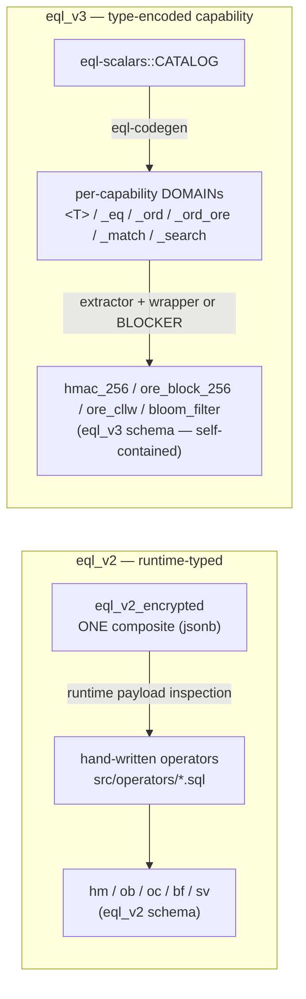
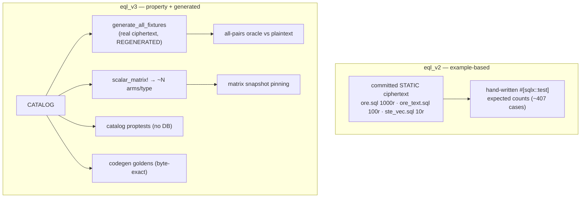

# `eql_v2` ↔ `eql_v3` Comparison & Gap Audit

> **Status:** Comparative audit, captured 2026-06-22; corrections re-verified 2026-06-24. Companion to the v3-only deep dive in `eql-v3-implementation-audit.md`.
> **Method:** Read-only, four parallel sub-audits (v2 capability inventory · test coverage · architecture · direct verification). Every claim cited `file:line`.
> **Scope:** `eql_v2` = all of `src/` **except** `src/v3/` (the documented, unchanged public API). `eql_v3` = `src/v3/` (new encrypted-domain surface).
>
> **`eql_v2` has since been removed from the tree (3.0.0).** Its `file:line` citations are no longer resolvable against the working tree — verify them against git history: the v2 **SQL surface** lives at `462b020c^` (parent of the removal commit "feat!: remove eql_v2 SQL surface"), and the v2 **test files** at `40d35e8c^` (they were deleted in a separate commit). e.g. `git show 462b020c^:src/operators/=.sql`. `eql_v3` citations resolve against the current tree.

---

## 0. Why `eql_v3` is a step-change — test coverage

**`eql_v3` is tested like a cryptographic library; `eql_v2` is tested like a feature.** v2 verifies a handful of hand-picked examples against ciphertext that was encrypted once and checked into the repo. v3 proves *properties* hold across the whole value space, against real ciphertext regenerated on every run, with the test surface itself pinned so coverage can't silently erode.

| Test capability | `eql_v2` | `eql_v3` | Impact |
|---|---|---|---|
| **Verification model** | example-based — assert specific expected counts on hand-picked rows | **property-based all-pairs oracle** — every ordered pair `(a,b)` checked against a plaintext oracle for `=` `<>` `<` `<=` `>` `>=` | Bugs hide between hand-picked examples; an oracle over the full pairing doesn't let them. |
| **Ciphertext source** | committed **static** blobs, pinned to one keyset (`tests/ore.sql`, `ste_vec.sql`) | **regenerated every prep** from the catalog via `cipherstash-client`; e2e re-encrypts live via ZeroKMS | v2 can pass against ciphertext that no longer matches current crypto; v3 can't. |
| **No-DB invariants** | none | pure-Rust **catalog proptests** (blocker non-STRICT+plpgsql, payload-keys==terms, ordering monotonic) | Safety invariants checked in milliseconds, on every PR incl. forks, before a DB even spins up. |
| **Determinism** | none | **byte-for-byte codegen goldens** — identical catalog ⇒ identical SQL | The generated surface is reproducible and reviewable, not trust-me output. |
| **Coverage erosion guard** | none — a deleted/`#[cfg]`-gated test vanishes silently | **snapshot-pinned test-name set**, cross-checked against the catalog's `list-types` | You cannot lose a test (or forget to wire a new type's matrix) without CI going red. |
| **Test authoring cost** | one hand-written test per case | one `scalar_matrix!{}` per type auto-emits ~N arms; one catalog row adds a whole type's suite | Coverage scales with the catalog, not with engineer keystrokes. |

**By the numbers**

| | `eql_v2` | `eql_v3` |
|---|---|---|
| Verification style | ~407 hand-written `#[sqlx::test]` cases (38 files, no macro expansion) | **2,547 runnable tests** — 2,085 generated matrix arms (10 types) + all-pairs oracle + property/edge suites |
| Distinct test tiers | 1 (SQLx examples) | **6** (catalog proptest · fixture oracle · cross-ciphertext · edge-cases · e2e · matrix) |
| Ciphertext freshness | frozen at commit | regenerated per prep + **fresh per e2e run** |
| CI gates with no v2 analog | — | **6** (`codegen:parity` · `self_contained_v3` · `clean_install_v3` · `matrix:inventory` · `matrix:catalog-coverage` · `e2e`) |
| Runs on fork PRs (no creds/DB) | partial | catalog proptests + codegen goldens + inventory — **full safety gate** |

> **Bottom line:** v3 closes the three ways an encryption test suite silently rots — stale ciphertext, an example that never covered the real edge, and a test that quietly stopped running. v2 is exposed to all three; v3 is gated against each.

---

## 1. TL;DR

`eql_v3` is **not** a rename of `eql_v2` — it is an additive, self-contained schema that re-architects the **scalar** surface around per-capability PostgreSQL domains generated from a Rust catalog. It is **strictly safer** (fail-closed equality, type-encoded capability, no ciphertext-order escape hatch) and **far better tested** (property oracle + generated matrix + real-ciphertext fixtures + codegen goldens + snapshot pinning). It is **not yet a functional superset**: it lacks database-side config/encryptindex and on-column opclass indexing. Two apparent "gaps" are deliberate security postures, not omissions: text match/search uses bloom containment instead of `LIKE`/`ILIKE`, and `bool` is store/decrypt-only (any boolean index term is a 2-value plaintext leak).

| | `eql_v2` | `eql_v3` |
|---|---|---|
| Type model | one runtime-typed composite `eql_v2_encrypted` | per-capability jsonb-backed **domains** per scalar |
| SQL origin | 100% hand-written | **generated** from `eql-scalars::CATALOG` |
| Crypto/index types | shared in `eql_v2` schema | **owns its own** SEM types, zero `eql_v2` dep |
| Equality when term missing | **fail-OPEN** (returns `NULL`) | **fail-CLOSED** (RAISE / type rejects) |
| Test style | example-based, **committed static** ciphertext | property oracle + matrix + **regenerated** ciphertext |
| Determinism gate | none | byte-for-byte codegen goldens |

---

## 2. Capability matrix

Legend: ✅ full · ◑ partial / different model · ❌ absent

| Capability | `eql_v2` | `eql_v3` | Notes |
|---|---|---|---|
| Equality `=` `<>` (HMAC `hm`) | ✅ `src/operators/=.sql:66` | ✅ per-type `_eq` domain | v3 also routes text eq through `hm`, never lossy ORE |
| Ordering `<` `<=` `>` `>=` (Block-ORE `ob`) | ✅ `src/operators/<.sql:78` | ✅ `_ord`/`_ord_ore` domains | v3 comparator is `IMMUTABLE`, block-count derived from length |
| `min` / `max` aggregates | ✅ generic `encrypted/aggregates.sql:18` | ◑ per-`_ord` type + SteVec entries | no single generic-encrypted aggregate in v3 |
| JSONB containment `@>` `<@` (SteVec) | ✅ `src/operators/@>.sql:31` | ✅ `src/v3/jsonb/operators.sql:139,214` | **shipped & in v3 build** (`deps-ordered-v3.txt`) |
| JSONB path `->` `->>` | ✅ `src/operators/->.sql:58` | ◑ `src/v3/jsonb/operators.sql:47,99` | typed `(json,text)`/`(json,int)` overloads only; **bare untyped literal RHS falls through to native — see §2a** |
| SteVec entry ordering (CLLW-ORE `oc`) | ✅ `src/operators/ste_vec_entry.sql:95` | ✅ `src/v3/jsonb/operators.sql:314` | `ore_cllw` SEM type used here, not orphaned |
| Native-jsonb op blockers (`?` `@?` `#>` `-` `||` …) | n/a | ✅ `src/v3/jsonb/blockers.sql:40-284` | fail-closed for mutate/predicate ops (**not** `->`/`->>`, §2a) |
| **Text match/search** | ✅ `LIKE` `~~` / `ILIKE` `~~*` (`src/operators/~~.sql:90,118`) | ◑ **different model**: `@>`/`<@` bloom containment | deliberate divergence: probabilistic ngram containment is not SQL wildcard/anchoring pattern matching |
| **`grouped_value(jsonb)`** aggregate (GROUP BY recipe) | ✅ `src/encrypted/functions.sql:97`, doc `json-support.md:203` | ❌ absent | v3 ships only typed `min`/`max`; documented grouping recipe has no v3 path |
| `eql_v2_encrypted` composite + `add_encrypted_constraint` | ✅ one untyped composite + helper that `ALTER TABLE … CHECK`s a plain column (`src/encrypted/casts.sql:14`, `constraints.sql`, `functions.sql:122`) | ◑ **different model — no 1:1 path** | v3 replaces the single composite with per-capability domains whose inline `CHECK` validates *more* strictly at cast/insert (committed golden `tests/codegen/reference/int4/int4_types.sql:30-38`; rendered from template `crates/eql-codegen/templates/types.sql.j2:16-25`); the `to_encrypted` cast + `add_encrypted_constraint` helper have no direct equivalent. Deliberate redesign, not drop-in |
| User-facing v3 JSON docs | ✅ `docs/reference/json-support.md` (all `eql_v2.*`) | ❌ thin | shipped v3 SteVec/JSONB has **no** user doc; caveats live only in SQL `@warning` comments |
| **Config management** (`eql_v2_configuration`, add/modify/remove search config, state machine) | ✅ `src/config/` (6 files) | ❌ absent | **decided: not ported DB-side** — kept permanently client-side (Protect-style); [#312](https://github.com/cipherstash/encrypt-query-language/issues/312) closed *not planned* |
| **Encryptindex migration** (create/rename cols, diff/activate) | ✅ `src/encryptindex/functions.sql` | ❌ absent | **decided: not ported DB-side** — client-side alongside config; [#312](https://github.com/cipherstash/encrypt-query-language/issues/312) closed *not planned* |
| `bool` query operators | ✅ equality via generic encrypted | ◑ **store/decrypt-only by design** | single `eql_v3.bool` domain, **all** operators (incl. `=`) are blockers; 2-value cardinality makes any index term a plaintext leak (`lib.rs:457`) — deliberate, not a parity gap |
| **blake3** index | ◑ legacy `b3`→`hm` | ❌ absent | already legacy in v2 |
| On-**column** btree/hash opclass (transparent `ORDER BY`/`GROUP BY`/`DISTINCT`/hash-join) | ✅ `src/operators/operator_class.sql:69`, `src/operators/hash_operator_class.sql:25` | ❌ forbidden on domains | v3 indexes via functional index on extractor (footgun: opclass-on-domain breaks blockers) |
| Total-order-over-ciphertext fallback | ◑ btree FUNCTION 1 raw-text fallback `src/operators/operator_class.sql:101` | ❌ none (intentional) | v2 fallback is a documented edge-case leakage shape; v3 has no escape hatch |

### 2a. Caveat: `->`/`->>` are *not* fail-closed against untyped literals

v3's native-jsonb blockers are genuinely fail-closed for **mutate/predicate** operators (`?` `?|` `?&` `@?` `@@` `#>` `#>>` `-` `#-` `||`): each binds the exact native RHS regtype with `LEFTARG = eql_v3.json` and `RAISE`s (`src/v3/jsonb/blockers.sql:40-284`). **But the two supported extraction operators `->`/`->>` are not.** v3 defines only `(eql_v3.json, text)` and `(eql_v3.json, integer)` overloads (`src/v3/jsonb/operators.sql:33-121`) with no `jsonb`-LHS override, so a **bare untyped literal** RHS routes to the native operator:

```sql
col -> 'sel'        -- ⚠ native jsonb->text: root-key lookup on the envelope, silently returns NULL
col -> 'sel'::text  -- ✅ v3 eql_v3."->"  (operators.sql:33)
col -> $1           -- ✅ v3 operator (typed param — the Proxy path)
```

`eql_v3.json` is a domain over `jsonb` (binary-coercible to its base), so the native base-type operator wins the exact-match tiebreak over the domain-typed v3 operator when the RHS is `unknown`. The failure is a **silent wrong answer / NULL (false-negative), not a plaintext leak**, and is documented in-source (`operators.sql:20-28` `@warning`; avoided in tests via explicit `::text` casts — `src/v3/jsonb/jsonb_test.sql:52` (`->`) and `:56` (`->>`)). The mitigation holds only because the CipherStash Proxy always sends typed `$n` parameters; any **direct-SQL** caller writing `col -> 'sel'` gets native semantics with no error. Suggested closure: add a `jsonb`-LHS `->`/`->>` blocker pair, or a test exercising the bare-literal path.

---

## 3. Architecture deltas



| Dimension | `eql_v2` | `eql_v3` | Verdict |
|---|---|---|---|
| **Capability location** | runtime payload key check | **type-system** (distinct domain per capability) | v3 — provisioning is a compile/plan-time fact |
| **Equality fail mode** | NULL when `hm` absent → row silently excluded (`src/operators/=.sql:68-74` STRICT body, `src/hmac_256/functions.sql:28`) | domain `CHECK (VALUE ? 'hm')` rejects un-provisioned value at cast/insert (committed golden `tests/codegen/reference/int4/int4_types.sql:36`; emitted by template `crates/eql-codegen/templates/types.sql.j2:18-19` from `Term::Hm => "hm"` at `crates/eql-scalars/src/term.rs:12`) | **v3 — most security-meaningful win** |
| **Ordering fail mode** | RAISE when `ob` absent (`ore_block_u64_8_256/functions.sql:49`) | RAISE when `ob` absent | parity |
| **Adding a type** | crypto-layer change; *no* per-type SQL | one `ScalarSpec` row → full surface regenerated | trade-off: v2 simpler, v3 safer/explicit |
| **Determinism** | none | byte-exact goldens `eql-codegen/tests/parity.rs:96` | v3 |
| **Self-containment** | none | zero `eql_v2.*`, build+CI enforced (`build.sh:59`, `self_contained_v3.sh:17`) | v3 — installs without `eql_v2` |
| **Inline/pin upkeep** | per-function **allowlist** (`tasks/pin_search_path.sql:99-295`) | **structural rule** (`tasks/pin_search_path_v3.sql:72-87`) | v3 — rule beats list |
| **Blocker discipline** | n/a (no blocker concept) | `LANGUAGE plpgsql` + non-`STRICT`, tested invariant | v3 |
| **Installed surface size** | one type + few operator files | (types × capabilities) domains + ~20-op blocker surface each | v2 simpler to read directly |

**v3 improvements (ranked):** ① fail-closed equality ② capability encoded in the type ③ catalog-generated + byte-exact determinism ④ structural self-containment ⑤ structural pin rule ⑥ no ciphertext-order escape hatch.

**v3 regressions / gaps vs v2:** ① per-domain combinatorial explosion (larger installed surface & dep graph) ② adding a type is heavier conceptually (catalog row + regen + fixtures + snapshots + goldens) ③ functional parity not reached — no config/encryptindex, no on-column opclass ④ load-bearing `<= 16` malformed-term guard in the shared ORE comparator (`src/v3/sem/ore_block_256/functions.sql:163`) is a subtle correctness surface v2 lacked (v2's comparator hardcoded an 8-block width — `src/ore_block_u64_8_256/functions.sql` — so it never derived block count from length and never needed the guard). Not listed here, because they are deliberate security postures rather than regressions: `LIKE`/`ILIKE` (v3 text match/search exposes bloom containment instead) and `bool` query operators (store/decrypt-only — any boolean index term is a 2-value plaintext leak).

---

## 4. Test coverage — the headline improvement

### 4.0 Test inventory — hard numbers

Counts re-verified 2026-06-24 against the current tree (`tests/sqlx/`, `crates/eql-scalars`, `crates/eql-codegen`, `tests/codegen/reference`) — i.e. **after** `eql_v2` and its tests were removed. (The original capture's `62` files / `617` `#[sqlx::test]` / `165` `#[test]` were the *combined* v2+v3 tree before v2-test removal in `40d35e8c`; the v3-only figures below replace them.)

Two counting conventions appear below. **Harness-listed** is the authoritative count: what `cargo test -- --list` enumerates after the test binaries compile — i.e. *post* macro expansion, so it includes every `scalar_matrix!{}`/`jsonb_matrix!{}` arm. It requires a build but **no database** (listing does not connect). **Source-grep** counts are literal `grep`/`find` over the committed `.rs` sources (reproducible on a fork, no build at all); they count the hand-written attrs *before* the matrix macros multiply them, so they are far smaller. The gap between the two is exactly the macro multiplication.

| Metric | Count | Source (counting method) |
|---|---:|---|
| **Total runnable tests** (the real figure) | **2,547** | `cargo test -- --list` (compiled + expanded, no DB) |
| …of which in the `encrypted_domain` binary (v3 matrix + property suites) | **2,256** | per-binary summary from the same `--list` |
| Rust test files (`tests/sqlx/tests/**/*.rs`) | **30** (53 across all `tests/sqlx`) | `find tests/sqlx/tests -name '*.rs' \| wc -l` |
| `#[sqlx::test]` attrs — source grep (pre-expansion) | **234** | `grep -rE '#\[sqlx::test' tests/sqlx --include='*.rs'` |
| `#[test]` attrs (non-DB) — source grep (pre-expansion) | **153** | `grep -rE '#\[test\]' tests/sqlx --include='*.rs'` |
| …of which under `encrypted_domain/` (the v3 suites), source grep | **101** `#[sqlx::test]` + **5** `#[test]` | `grep -rE … tests/sqlx/tests/encrypted_domain/` |
| **Generated scalar-matrix test names** (pinned in snapshots) | **2,085** | see expansion below (these are the macro-expanded arms, not source grep) |
| Generated JSONB-entry matrix names | **55** | `matrix_jsonb_entry_tests.txt` |
| v3 JSONB top-level pinned names | **76** | `v3_jsonb_tests.txt` (was 74 at capture; [#318](https://github.com/cipherstash/encrypt-query-language/pull/318) added 2) |
| Catalog property tests (no DB): 1 `proptest!` group + 6 `#[test]` | **7** | `proptest_invariants.rs` |
| Codegen parity tests | **4** | `eql-codegen/tests/` |
| Codegen golden reference files (10 token dirs) | **107** | `tests/codegen/reference/` |

**Generated matrix expansion** — snapshots are `<T>`-templated; the macro emits one test per name × the types of that shape:

| Shape | Names/type | Types | Total | Snapshot |
|---|---:|---:|---:|---|
| Ordered scalar (`int2/4/8`, `float4/8`, `numeric`, `date`, `timestamptz`) | 220 | 8 | **1,760** | `matrix_tests.txt` |
| Text (eq + ord + match/search) | 306 | 1 | **306** | `matrix_tests_text.txt` |
| Storage-only (`bool`) | 19 | 1 | **19** | `matrix_tests_storage_only.txt` |
| **Total generated scalar-matrix tests** | | **10** | **2,085** | |

> `matrix_tests_eq_only.txt` (54) is a derived/hypothetical shape no live type currently uses; it pins the eq-only emission path but isn't multiplied into the total. v2 has **0** generated tests — its ~407 `#[sqlx::test]` cases (counted at `40d35e8c^`) are all hand-written.

### 4.1 v2 vs v3 at a glance

| | `eql_v2` | `eql_v3` |
|---|---:|---:|
| Generated tests | 0 | **2,085** scalar + 55 entry |
| Distinct test tiers | 1 | **6** |
| No-DB safety tests (run on fork PRs) | 0 | 7 catalog + 4 codegen parity |
| Codegen golden files | 0 | 107 |
| Ciphertext | frozen at commit | regenerated per prep + fresh per e2e run |



| Dimension | `eql_v2` | `eql_v3` | Better? |
|---|---|---|---|
| Methodology | example-based, hand-picked counts (`comparison_tests.rs:48`) | property all-pairs oracle (`src/property.rs:84`) + generated matrix (`matrix.rs:174`) | ✅ generalizes over value space |
| Fixtures | **committed static** blobs, keyset-pinned (`tests/ore.sql:1`, `ORE_FIXTURES.md:67`) | **gitignored, regenerated** each prep via `cipherstash-client` (`generate_all_fixtures.rs`) | ✅ no stale keysets |
| Equal-plaintext / distinct-ciphertext | implicit | explicit `_doubles` fixtures → `cross_ciphertext.rs` | ✅ |
| No-DB invariants | none | pure-Rust proptests: blocker non-STRICT+plpgsql, payload-keys==terms (`proptest_invariants.rs`) | ✅ net-new |
| Codegen determinism | n/a | byte-for-byte goldens (`tests/codegen/reference/<T>/`) | ✅ net-new |
| Test-name coverage pinning | none — deleted test vanishes silently | snapshot inventory cross-checked vs `list-types` (`snapshots/`) | ✅ net-new |
| Live crypto-path regression | frozen blobs only | e2e re-encrypts every run via ZeroKMS (`e2e_oracle.rs`, `proptest-e2e`) | ✅ net-new |

### v3 test suites

| Suite | Location | Covers | DB | Creds |
|---|---|---|---|---|
| catalog (proptest) | `crates/eql-scalars/src/proptest_invariants.rs` | term/op/extractor consistency, payload-keys==terms, int-range ordering | ❌ | ❌ |
| fixture oracle | `…/property/fixture_oracle.rs` | all-pairs eq/ord + function-double + extractor identity over committed ciphertext | ✅ | ❌ |
| cross_ciphertext | `…/property/cross_ciphertext.rs` | equal plaintext / distinct ciphertext compare equal (hm + ORE) | ✅ | ❌ |
| match_smoke | `…/property/match_smoke.rs` | text bloom `@>`/`<@` containment | ✅ | ❌ |
| edge_cases | `…/property/edge_cases.rs` | NULL propagation, blockers raise, CHECK rejects, every blocker non-STRICT+plpgsql | ✅ | ❌ |
| e2e oracle | `…/property/e2e_oracle.rs` | same oracle over **fresh ZeroKMS** encryption | ✅ | **✅** |
| scalar matrix | `src/matrix.rs` | per-(category,domain,op,pivot) arms: sanity, pivots, NULL, blockers, index-engages, aggregates, order_by | ✅ | ❌ |
| family | `…/family/{inlinability,mutations,support,sem,jsonb_operator_surface}.rs` | inlining, negative-control mutations, SEM types, jsonb op surface | ✅ | ❌ |
| codegen parity | `eql-codegen/tests/parity.rs` | byte-exact vs goldens; determinism; reference dirs == catalog tokens | ❌ | ❌ |
| matrix inventory | `tests/sqlx/snapshots/*.txt` | pins test-name set; discovered types == `list-types` | ❌ | ❌ |

### CI gates (v3-only, no v2 analog)
`codegen:parity` · `self_contained_v3` + `clean_install_v3` · `matrix:inventory` + `matrix:catalog-coverage` · `rust-crates` (catalog proptest) · `e2e` (fresh ZeroKMS). v2 rides only the shared sharded SQLx run (PG 14–17) with **no** coverage-pinning, codegen, self-containment, or property gate.

### Test gaps where v3 < v2 (feature-driven)
1. **SteVec/JSONB queries** — capability shipped, but coverage rides a **committed, hand-written** fixture (`v3_ste_vec.sql`, `v3_doc_int4.sql`) pending a SteVec-document generator; v2 has a fuller query test set (`jsonb_tests.rs`, `jsonb_path_operators_tests.rs`, containment-uses-index tests).
2. **Text match/search semantics** — v2 `like_operator_tests.rs` covers SQL pattern operators; v3 `match_smoke.rs` covers deliberate bloom-containment `@>`/`<@` semantics, with no `~~`/`~~*` surface planned unless semantics change.
3. **ORE text-at-scale** — v2 `ore_text.sql` (100 lexically sorted words) + `ore_text_order_tests.rs`; v3 text ordering exercises curated catalog pivots only.
4. **Config / encryptindex** — v2 `config_tests.rs` (16), `encryptindex_tests.rs` (7); no v3 analog (intentional scope).
5. **Operator-class indexes** — v2 `operator_class_tests.rs`, `ore_cllw_opclass_tests.rs`; v3 uses functional indexes by design, no opclass mirror.

> Note: `ore_block_comparator_tests.rs` is v2-named but already loads **v3** fixtures (`eql_v3_numeric`/`eql_v3_timestamptz`) — partial migration of v2 ORE-comparator coverage onto the v3 pipeline.

---

## 5. Net assessment

| Question | Answer |
|---|---|
| Is v3 safer than v2? | **Yes** — fail-closed equality + type-encoded capability + no ciphertext-order fallback. |
| Is v3 better tested than v2? | **Yes, decisively** — property oracle, generated matrix, regenerated real ciphertext, codegen goldens, snapshot pinning, self-containment + e2e gates. None exist for v2. |
| Is v3 a functional superset of v2? | **Not yet.** Real gaps: config/encryptindex, on-column opclass indexing, `grouped_value` GROUP BY recipe, user-facing JSON docs. SteVec/JSONB **is** shipped (contrary to the stale note in the v3-only audit), but its tests are still hand-written and do not yet have the scalar suite's property/e2e oracle strength. Two divergences are deliberate security postures, not gaps: text match/search (bloom containment, not `LIKE`/`ILIKE`) and `bool` (store/decrypt-only). |
| Biggest risks to track | (1) `->`/`->>` silently fall through to native `jsonb->text` on untyped literals (§2a) — direct-SQL callers get NULL, not an error. (2) Shared ORE comparator's `<= 16` malformed-term guard (`src/v3/sem/ore_block_256/functions.sql:163`) — load-bearing, warrants targeted coverage. |

### 5a. Disposition of every v2→v3 difference

So each difference carries an explicit decision, not an implied "TODO":

| v2 → v3 difference | Disposition | Status |
|---|---|---|
| Config management (`src/config/*`, 6 files) + encryptindex migration (`src/encryptindex/functions.sql`) | **Decided: not ported DB-side** — kept permanently client-side (Protect-style) | [#312](https://github.com/cipherstash/encrypt-query-language/issues/312) closed *not planned* |
| `eql_v2_encrypted` composite + `add_encrypted_constraint` | **Different model, no 1:1 path** — replaced by per-capability domains with stricter inline `CHECK`; deliberate redesign | Decided (by design) |
| `LIKE` `~~` / `ILIKE` `~~*` (bloom `bf` / match) | **Different model, by design** — v3 *does* ship a bloom match surface (`eql_v3.text_match` / `text_search`, `@>`/`<@` containment, `match_term`→`bloom_filter`); only the `~~`/`~~*` operator spelling is v2-only. Probabilistic ngram containment ≠ SQL wildcard/anchoring | Decided (by design) |
| `bool` query operators | **By design** — store/decrypt-only; any boolean index term is a 2-value plaintext leak | Decided (by design) |
| `->`/`->>` untyped-literal fallthrough (§2a) | **Inherent to the `jsonb`-domain type-kind & accepted** — mitigated by typed Proxy params | Decided (documented) |
| On-column btree/hash opclass | **By design** — opclass-on-domain breaks blockers; index via functional index on extractor | Decided (by design) |
| `grouped_value` GROUP BY recipe · user-facing v3 JSON docs | **True gaps to close** — tractable follow-ups, no decision blocking them | Open (no issue yet) |
| blake3 | **N/A** — already legacy in v2 | Decided (dropped) |
| Uninstall drops schema only | **Correct by design** (no config table) | Decided |

### Top gaps to close for v2 parity (priority order)
1. Document/migration guidance for text match/search: v2 `LIKE`/`ILIKE` wildcard patterns do not map to v3 probabilistic ngram bloom containment (`@>`/`<@`); adding `~~`/`~~*` is not planned unless those semantics change.
2. SteVec-document **fixture generator** → retire committed `v3_ste_vec.sql` exception; widen JSONB query tests.
3. Document that encrypted `bool` is store/decrypt-only in v3 (all query operators are blockers by design — any boolean index term is a 2-value plaintext leak). Not a fix; a docs note.
4. Decide config/encryptindex: port DB-side, or document as permanently client-side (Protect-style).
5. Close the `->`/`->>` untyped-literal hole (§2a): add a `jsonb`-LHS blocker pair, or a regression test for the bare-literal path.
6. Port the `grouped_value` GROUP BY recipe, and write user-facing v3 JSON docs (current `json-support.md` is 100% `eql_v2.*`).

> **Correction to `eql-v3-implementation-audit.md` §3.1 / §1 scope note:** v3 SteVec/JSONB is **implemented and in the v3 build** (`src/v3/jsonb/{types,functions,operators,aggregates,blockers}.sql`, 5 entries in `src/deps-ordered-v3.txt`), not "a separate design not yet implemented." Only its *fixture generation* is outstanding.
