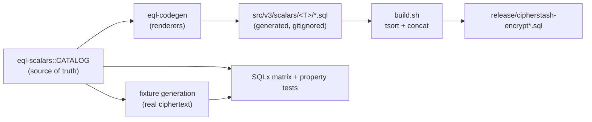
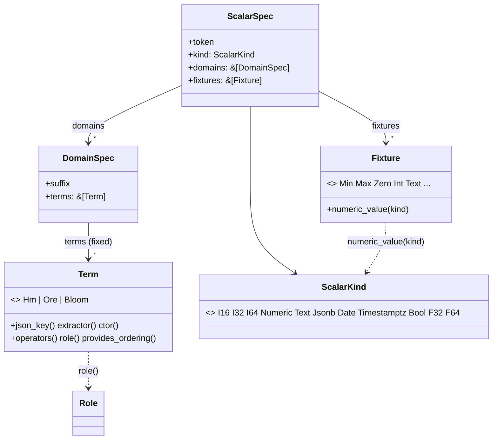
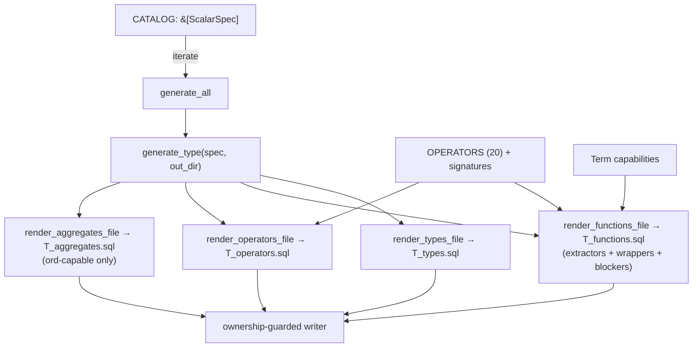
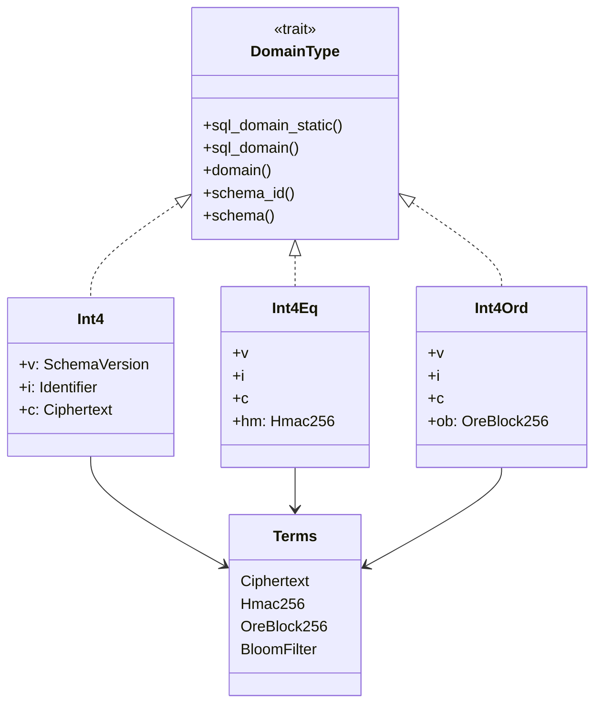
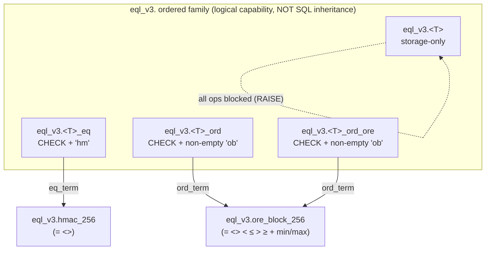
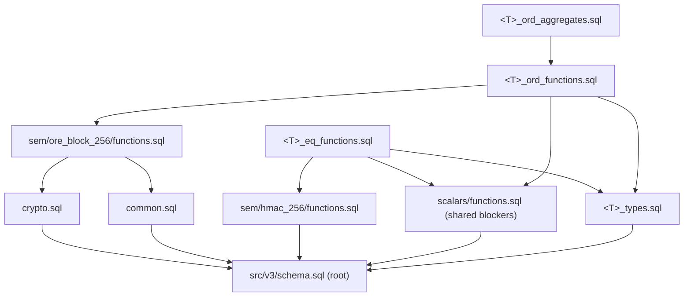
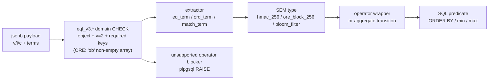
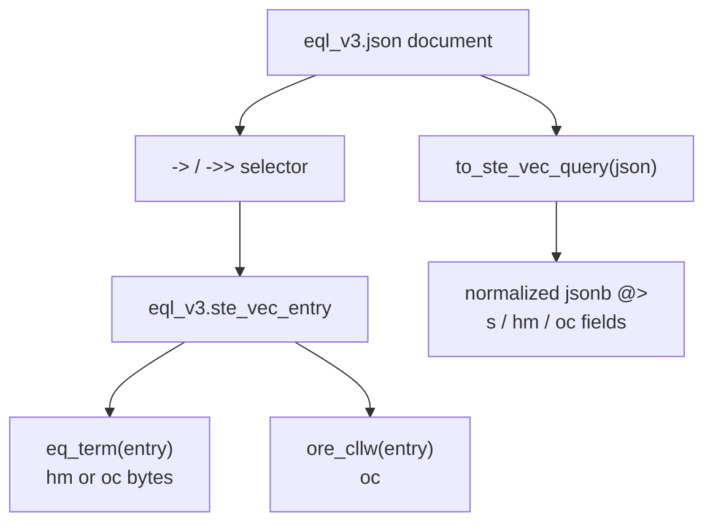
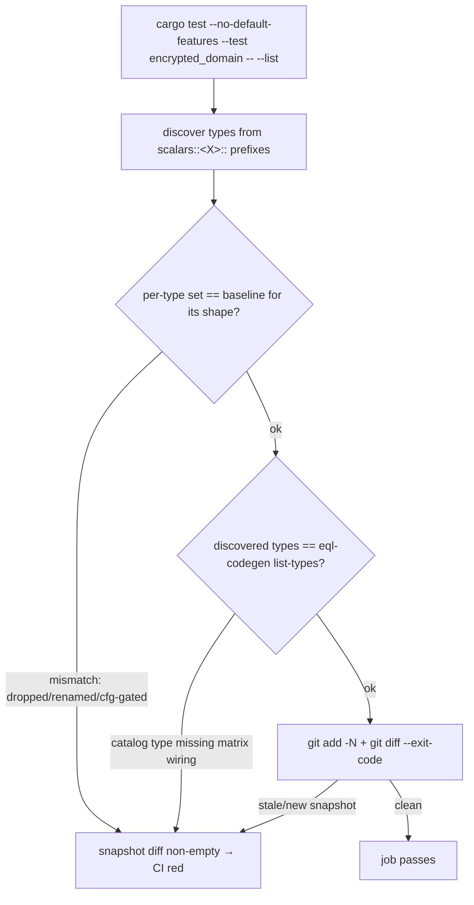
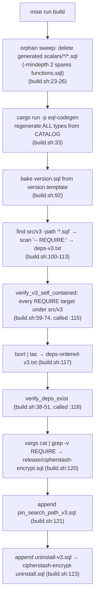

# `eql_v3` Implementation Audit

> **Status:** Reference snapshot of the current `eql_v3` encrypted-domain implementation, captured 2026-06-22, re-verified 2026-06-23 against the 3.0.0 build/schema overhaul (single self-contained installer; `eql_v2` removed), and re-verified 2026-06-24 to incorporate the empty-ORE-term domain CHECK (#262/#316) and the `->`/`->>` bare-literal domain-flattening footgun (#318).
> **Method:** Read-only audit across four domains — Rust crates, generated/hand-written SQL, test infrastructure, and the build system. Every claim is cited as `file_path:line`.

## 1. Executive summary

`eql_v3` is **the** PostgreSQL schema EQL ships — a self-contained surface for searchable encryption over scalar types. As of 3.0.0 the earlier `eql_v2` schema (composite `eql_v2_encrypted` column type, database-side config management, operator-class-on-column indexing) has been **removed**: it is no longer built or shipped, surviving only in fork-provenance comments under `src/v3/` and in historical records (`CHANGELOG.md`, the v2.x upgrade guides). `eql_v3` is jsonb-backed **PostgreSQL domains** — one domain per operator/index capability — and owns its own copies of the SEM (searchable-encrypted-metadata) index-term types, so it installs into a database with **no other EQL schema present** and has **zero dependency on `eql_v2`**.

The entire SQL surface is **generated from a single Rust catalog**. The data flow is strictly one-directional:



Three properties define the design and are enforced mechanically (not by convention):

1. **Self-containment** — no `eql_v2.<symbol>` appears in executable `src/v3/` SQL; enforced at build time (`verify_v3_self_contained`) and in CI (`test:self_contained_v3`).
2. **Determinism** — identical `CATALOG` produces byte-identical SQL; enforced by codegen parity goldens.
3. **Fail-closed capability** — a value cannot be queried without provisioning the matching index term; storage-only domains block *every* operator including `=`.

### Scope note

The `int4` family is the reference implementation, but the live surface is wider: **8 ordered scalar families** (`int2`, `int4`, `int8`, `float4`, `float8`, `numeric`, `date`, `timestamptz`), plus `bool` (storage-only, all operators blocked), plus `text` (adds match/search via bloom filter), plus a separate `jsonb`/SteVec design. The SEM layer carries **four** index-term types (`hmac_256`, `ore_block_256`, `bloom_filter`, `ore_cllw`), not two.

---

## 2. Crate structure

The workspace has five members (`Cargo.toml:21-30`). The core production path is catalog -> SQL renderer -> generated SQL; the adjacent type and test crates keep the wire format and SQLx coverage aligned with that same catalog.

| Crate | Role | Main dependencies |
|---|---|---|
| `crates/eql-scalars` | The **catalog** — source of truth for scalar types, domains, terms, fixtures | Zero runtime deps (`crates/eql-scalars/Cargo.toml:7-10`); `proptest` dev-only |
| `crates/eql-codegen` | The **renderer** — turns each `CATALOG` row into SQL | `eql-scalars`, `minijinja`, `serde`, `serde_json`, `thiserror` (`crates/eql-codegen/Cargo.toml:7-12`) |
| `crates/eql-types` | Canonical Rust/TS/JSON Schema payload structs for each `eql_v3` SQL domain | `serde`, `ts-rs`, `schemars`; dev parity against `eql-scalars` (`crates/eql-types/Cargo.toml:7-17`) |
| `crates/eql-tests-macros` | Proc-macro fan-out for the SQLx scalar matrix from one scalar list | `syn`, `quote`, `proc-macro2`, `eql-scalars` (`crates/eql-tests-macros/Cargo.toml:11-14`) |
| `tests/sqlx` | Integration-test harness and fixture/oracle runner | `sqlx`, `tokio`, `cipherstash-client`, `eql-scalars`, `eql-tests-macros`, `proptest` (`tests/sqlx/Cargo.toml:7-39`) |

### 2.1 `eql-scalars` — the catalog

Definitions live in `lib.rs`; inherent `impl`s split into `kind`/`term`/`fixture`/`spec` modules.

| Item | Kind | Location | Role |
|---|---|---|---|
| `ScalarSpec` | struct | `lib.rs:210-216` | One scalar type: `token`, `kind`, `domains`, `fixtures` |
| `DomainSpec` | struct | `lib.rs:201-205` | One generated domain: `suffix` + fixed `terms` (`""` = storage-only) |
| `ScalarKind` | enum | `lib.rs:52-93` | Native scalar a domain maps onto (`I16`…`Jsonb`) |
| `BoundedIntKind` | enum | `lib.rs:36-41` | Total accessor for the 3 integer kinds; makes non-int bounded access a compile-time impossibility |
| `Term` | enum | `lib.rs:112-117` | `Hm` (equality), `Ore` (eq + ordering), `Bloom` (containment/match) |
| `Role` | enum | `lib.rs:125-160` | Whole-domain file role with `rank()` precedence `Ord > Eq > Match > Storage` |
| `Fixture` | enum | `lib.rs:170-197` | Value-kind-tagged plaintext (`Min`/`Max`/`Zero`/`Int`/typed variants) |
| `CATALOG` | const | `lib.rs:568-579` | Ordered source-of-truth slice (10 types) |
| `ENVELOPE_KEYS` | const | `lib.rs:104` | `["v","i","c"]` — always-present payload CHECK keys |

**Capability model** is fixed in `Term` `impl` methods (`term.rs:10-73`), not in catalog data:

| Term | `json_key` | extractor | constructor | operators | role | ordering? |
|---|---|---|---|---|---|---|
| `Hm` | `"hm"` | `eq_term` | `hmac_256` | `=`, `<>` | `Eq` | no |
| `Ore` | `"ob"` | `ord_term` | `ore_block_256` | `=`, `<>`, `<`, `<=`, `>`, `>=` | `Ord` | yes |
| `Bloom` | `"bf"` | `match_term` | `bloom_filter` | `@>`, `<@` | `Match` | no |

**Domain suffix → term mapping:**

| Suffix | Terms (int) | Terms (text) | Capability |
|---|---|---|---|
| `""` (storage) | `[]` | `[]` | storage-only — all ops blocked |
| `_eq` | `[Hm]` | `[Hm]` | equality |
| `_ord` / `_ord_ore` | `[Ore]` | `[Hm, Ore]` | order + eq |
| `_match` | — | `[Bloom]` | LIKE / containment |
| `_search` | — | `[Hm, Ore, Bloom]` | all three |

> **Design note:** integer `_ord` domains are `[Ore]`-only (ORE equality is lossless for ints), but `text` ordered domains lead with `Hm` so `=`/`<>` route through exact `hm`, never lossy ORE (`lib.rs:415-450`). `bool` is storage-only (single term-less domain) to avoid low-cardinality leakage.
>
> **Non-empty-array terms:** beyond `json_key`, a term may declare that its payload key must hold a *non-empty array* via `Term::nonempty_array_key` (`term.rs:82-87`). Only `Ore` opts in: the empty-ORE payload `ob: []` (produced solely by encrypting `''` into an ordered column) must be rejected at the domain CHECK rather than mis-ordered (issue #262/#316). `Term::nonempty_array_keys` (`term.rs:116-118`) is the domain-level rollup the renderer consumes — symmetric to `term_json_keys`, so the CHECK never hardcodes a single key.

**Fixture materialization** (`fixture.rs:13-40`, `lib.rs:591-660`): `Fixture::numeric_value(kind)` is a `const fn` resolving int fixtures to `i128`. The `int_values!` / `text_values!` macros const-evaluate these into `&'static` slices (`INT4_VALUES`, `TEXT_VALUES`, …) with compile-time bounds re-checks. Non-const kinds (`date`/`numeric`/`float`/`bool`/`timestamptz`) expose their `ScalarSpec` as `pub` and the SQLx harness parses `.fixtures` at runtime. This replaces the old committed generated `<T>_values.rs` — no Rust-source round-trip.



### 2.2 `eql-codegen` — the renderer

Templates are `include_str!`-embedded (no runtime template IO). Binary `eql-codegen` + lib `eql_codegen`.

| Module | Key items | Role |
|---|---|---|
| `main.rs` | arg dispatch (`main.rs:6-46`) | no args → `generate_all`; `list-types`; `dump-catalog` |
| `generate.rs` | `render_{types,functions,operators,aggregates}_file`, `generate_type`, `generate_all` | per-file renderers + orchestrator |
| `context.rs` | minijinja `environment()`, serde contexts, `FnEntry`/`DomainBlock`/`OpEntry` | template contexts + relocated logic |
| `operator_surface.rs` | `Operator`, `OPERATORS` (20), `is_native_jsonb_blocker` | full 20-operator surface + Postgres signatures |
| `writer.rs` | ownership-guarded write (`writer.rs:63-106`) | refuses to clobber files lacking the generated-marker header |
| `tests/parity.rs` | byte-for-byte gate vs `tests/codegen/reference/<token>/` | determinism + golden enforcement |

**Binary entrypoints:**

- `cargo run -p eql-codegen` (no args) → `generate_all` regenerates every type's gitignored SQL. This is what `mise run build` invokes (`main.rs:30-40`).
- `cargo run -p eql-codegen -- list-types` → one token per line; consumed by matrix-inventory (`main.rs:11-16`).
- `cargo run -p eql-codegen -- dump-catalog` → JSON of `(type → domain → ops)`; consumed by catalog-coverage (`main.rs:21-28`).

**Per-type emission** (`generate.rs:206-268`): for each `ScalarSpec`, writes `<token>_types.sql` (one `CREATE DOMAIN … AS jsonb` per domain), then per domain `<name>_functions.sql` + `<name>_operators.sql`, and `<name>_aggregates.sql` only when ord-capable. `render_functions_file` emits one extractor per distinct extractor-term, then iterates all 20 operators × signatures emitting either an inlinable `LANGUAGE sql` **wrapper** (if supported) or a `LANGUAGE plpgsql` **blocker** (if not). The native-jsonb blocker set is **derived by exclusion** (`operator_surface.rs:208-216`) so adding an operator auto-classifies it.



### 2.3 `eql-types` — canonical v3 payloads

`eql-types` models the JSON payload shape that flows into the `jsonb` domains. It is deliberately domain-explicit: there is one Rust struct per SQL domain, and `v3::all()` enumerates those structs in `eql-scalars::CATALOG` order (`crates/eql-types/src/v3/mod.rs:135-180`). Catalog parity tests fail if that list drifts from the generated SQL domain inventory.

Each payload always carries the envelope keys `v`, `i`, and `c`; capability-specific structs add only the terms required by that SQL domain (`crates/eql-types/src/v3/mod.rs:19-35`). `SchemaVersion` is a private `u16` newtype whose only constructible/deserializable value is `2`, with JSON Schema emitted as `const: 2` (`crates/eql-types/src/lib.rs:29-100`). `Identifier` is the shared `{ "t": "...", "c": "..." }` table/column value (`crates/eql-types/src/lib.rs:103-114`). There is no `Option`-based "maybe term" struct and no discriminated enum: many domains are wire-identical across tokens, and `_ord` versus `_ord_ore` is intentionally indistinguishable on the wire (`crates/eql-types/src/v3/mod.rs:37-45`).

| Type family | Struct shape | SQL/domain relationship |
|---|---|---|
| Storage | `{ v, i, c }` | storage-only domains such as `eql_v3.int4` |
| Equality | `{ v, i, c, hm }` | `_eq` domains; `hm: Hmac256` |
| Order | `{ v, i, c, ob }` | `_ord` / `_ord_ore` domains; `ob: OreBlock256` |
| Match | `{ v, i, c, bf }` | text `_match`; `bf: BloomFilter` |
| Search | `{ v, i, c, hm, ob, bf }` | text `_search` |



Reusable term newtypes live in `v3::terms`: `Ciphertext(String)` for `c`, `Hmac256(String)` for `hm`, `OreBlock256(Vec<String>)` for `ob`, and `BloomFilter(Vec<i16>)` for `bf` (`crates/eql-types/src/v3/terms.rs:18-49`). `BloomFilter` has a manual JSON Schema implementation so its elements validate as PostgreSQL `smallint` range values, not merely annotated `int16` values (`crates/eql-types/src/v3/terms.rs:51-98`).

### 2.4 Test support crates

`eql-tests-macros` keeps the SQLx matrix from forking into several hand-maintained lists. Its input is a `token => rust_type` list, while capability shape is read back from `eql-scalars::CATALOG` at macro-expansion time (`crates/eql-tests-macros/src/lib.rs:37-66`). The macros classify temporal, integer, text, numeric, float, storage-only, equality-only, and search-capable tokens from catalog methods (`crates/eql-tests-macros/src/lib.rs:68-144`), then emit only the wiring needed in the current compilation context.

`tests/sqlx` is a normal workspace crate named `eql_tests`, not just a directory of integration tests. It exposes the assertion builders, fixture loaders, scalar-domain model, matrix machinery, property oracles, and selectors consumed by the integration-test binaries (`tests/sqlx/src/lib.rs:16-54`). It aliases itself as `eql_tests` so macro expansions resolve the same way from the library crate and from integration-test crates (`tests/sqlx/src/lib.rs:5-12`).

The main runtime descriptors are:

| Type | Location | Role |
|---|---|---|
| `ScalarType` | `tests/sqlx/src/scalar_domains.rs:18-146` | Generic contract for one plaintext scalar: Postgres type token, fixture values, SQL domain derivation, extractor expressions, SQL literal rendering, oracle result sets, and proptest strategy. |
| `OrderedScalar` / `SignedScalar` / `MatchScalar` | `tests/sqlx/src/scalar_domains.rs:160-223` | Capability traits that gate ordered, sign-boundary, and bloom-match matrix arms at compile time. |
| `Variant` | `tests/sqlx/src/scalar_domains.rs:1083-1195` | Runtime domain variant (`Storage`, `Eq`, `Ord`, `OrdOre`, `Search`) whose suffixes, terms, required payload keys, supported operators, and extractors are resolved from `CATALOG`. |
| `ScalarDomainSpec` | `tests/sqlx/src/scalar_domains.rs:1202-1269` | Runtime `(ScalarType, Variant)` descriptor used by matrix tests: schema-qualified domain, column expression, placeholder payload, extractors, and catalog token. |
| `FixtureSpec<T>` | `tests/sqlx/src/fixtures/spec.rs:28-233` | Typed fixture-generation contract: validated fixture name, index list, payload column type, plaintext values, and storage-only mode. |

---

## 3. SQL surface (`src/v3/`)

### 3.1 Domain type families

All domains are **jsonb-backed** with a `CHECK` requiring an object carrying `v`/`i`/`c` (and `v = '2'`) plus the index-term key(s) gating the capability. ORE-bearing domains additionally require `ob` to be a **non-empty array** — `jsonb_typeof(VALUE -> 'ob') = 'array' AND jsonb_array_length(VALUE -> 'ob') > 0` — so the empty-ORE payload (`ob: []`, only ever produced by encrypting `''` into an ordered column) is **rejected at the domain boundary** with a `23514` check violation rather than mis-ordered downstream (issue #262/#316). The clause is data-driven, not hardcoded per type: it is emitted for any term opting in via `Term::nonempty_array_key` (`crates/eql-scalars/src/term.rs:82-87`, currently `Ore` only) → `DomainBlock.nonempty_array_keys` (`crates/eql-codegen/src/context.rs:66,93`), and so appears on every `<T>_ord` / `<T>_ord_ore` and on text `_search` (e.g. `int4_types.sql` `int4_ord`/`int4_ord_ore` CHECKs; reference golden `tests/codegen/reference/int4/int4_types.sql:53-54,71-72`). **No domain-over-domain exists** — every `CREATE DOMAIN … AS` resolves to a base type (`jsonb`/`text`/`smallint[]`), never another `eql_v3` domain (`int4_types.sql:14,29,45,63`). This is structurally required: operators resolve against base `jsonb`, so a derived domain would not inherit the blocker surface.

| Family | Domains | CHECK requires | Capability |
|---|---|---|---|
| 8 ordered scalars (`int2/4/8`, `float4/8`, `numeric`, `date`, `timestamptz`) | `<T>` / `<T>_eq` / `<T>_ord` / `<T>_ord_ore` | none / `hm` / `ob` (non-empty array) / `ob` (non-empty array) | storage / eq / order+eq / order+eq |
| `bool` | `bool` only | none | storage-only — **all operators blocked** |
| `text` | `text` / `_eq` / `_ord` / `_ord_ore` / `_match` / `_search` | `hm` / `ob` (non-empty) / `bf` / all (`ob` non-empty) | eq / order / LIKE / all three |
| `jsonb` (separate design) | `json` / `ste_vec_entry` / `ste_vec_query` | SteVec document model | not the ordered-scalar materializer |



> The four domains are independent `AS jsonb` siblings, **not** derived from each other.

### 3.2 Functions

| Function | LANGUAGE | Volatility | STRICT | Purpose |
|---|---|---|---|---|
| `eq_term(<T>_eq) → hmac_256` | sql | IMMUTABLE | yes | extract `hm` (`int4_eq_functions.sql:13`) |
| `ord_term(<T>_ord[_ore]) → ore_block_256` | sql | IMMUTABLE | yes | extract `ob` (`int4_ord_functions.sql:14`) |
| `match_term(text_*) → bloom_filter` | sql | IMMUTABLE | yes | extract `bf` |
| `eq`/`neq`/`lt`/`lte`/`gt`/`gte` wrappers | sql | IMMUTABLE | yes | `<extractor>(a) <op> <extractor>(b)` |
| `min_sfunc`/`max_sfunc` | **plpgsql** | IMMUTABLE | yes | aggregate transition (`int4_ord_aggregates.sql:14,41`) |
| `min`/`max` AGGREGATE | — | — | — | `sfunc` + `combinefunc`, `parallel=safe` |

Extractors/wrappers are inlinable: `LANGUAGE sql`, single `SELECT`, `IMMUTABLE`, **no `SET search_path`** (pinning would defeat inlining). Aggregate state funcs are correctly plpgsql (multi-statement) and may pin. Each wrapper has **3 overloads** — `(<T>,<T>)`, `(<T>,jsonb)`, `(jsonb,<T>)` — so bare-form `WHERE col = $1::jsonb` resolves.

### 3.3 SEM index-term types (hand-written, `src/v3/sem/`)

| Type | Kind | Cite |
|---|---|---|
| `eql_v3.hmac_256` | DOMAIN `AS text` | `sem/hmac_256/types.sql:12` |
| `eql_v3.ore_block_256_term` | composite `(bytes bytea)` | `sem/ore_block_256/types.sql:13` |
| `eql_v3.ore_block_256` | composite `(terms ore_block_256_term[])` | `sem/ore_block_256/types.sql:24` |
| `eql_v3.bloom_filter` | DOMAIN `AS smallint[]` | `sem/bloom_filter/types.sql:14` |
| `eql_v3.ore_cllw` | composite `(bytes bytea)` | `sem/ore_cllw/types.sql:21` |

`ore_block_256(jsonb)` is plpgsql and `STRICT` (must RAISE when `ob` absent, `sem/ore_block_256/functions.sql:64-77`), but its inlinable helpers carry a `COMMENT … 'eql-inline-critical'` marker so the post-install pin pass leaves them unpinned. `compare_ore_block_256_term` is `IMMUTABLE` and **deliberately NOT STRICT** (NULL branches are load-bearing); block count N is derived from ciphertext length (`49*N+16`), not hardcoded, with a `<= 16` malformed-term guard (`functions.sql:163`).

**Empty-array ordering is load-bearing (issue #262).** The new ORE-domain CHECK (§3.1) rejects `ob: []` on cast/insert, but the comparator path is hardened independently as defence-in-depth: `jsonb_array_to_ore_block_256` **`COALESCE`s an empty `array_agg` to a zero-term `ore_block_256_term[]`** rather than NULL (`functions.sql:35-56`), because a NULL term makes the comparator return NULL — silently dropping an empty-text row from `ORDER BY` and letting `eql_v3.max` wrongly return it. A non-NULL zero-term composite instead engages the array comparator's `cardinality = 0` guard (`compare_ore_block_256_terms`, `functions.sql:230-238`), which canonically sorts **empty before every non-empty term**. So the two layers agree: empty ORE is rejected at the domain boundary, and any empty term that still reaches the comparator (e.g. via the raw-jsonb SEM helpers, which bypass the domain CHECK) sorts first deterministically. The composite gets a **DEFAULT btree opclass** so `CREATE INDEX ON t (eql_v3.ord_term(col))` engages without an explicit opclass. The `=` operator declares `COMMUTATOR = =` + `HASHES, MERGES`.

`bloom_filter` ships no operators file — text `_match` containment (`@>`/`<@`) rides on the **native `smallint[]` array operators** inherited through the domain (`sem/bloom_filter/types.sql`). `ore_cllw` (CLLW comparator + its own btree `operator_class.sql`) is the ordered comparison path for the `jsonb`/SteVec surface (`<`/`<=`/`>`/`>=` over `oc` terms), parallel to `ore_block_256` for scalars. Both `ore_block_256` and `ore_cllw` operator classes index through a functional index on the extractor (default btree opclass), not an operator class on a column, so they install on Supabase / managed Postgres without superuser privileges — which is why the dedicated Supabase subset build was dropped in 3.0.0 (see §5.1). (Stale `*operator_class.sql` comments still referencing a "Supabase variant" are leftovers from the multi-variant build and no longer reflect a real build path.)

### 3.4 Blockers

Three shared return-type-variant helpers in `src/v3/scalars/functions.sql` (`_bool`, `_jsonb`, `_text`) plus per-domain blockers covering every native jsonb operator reachable through domain fallback. **Both footguns are upheld everywhere:**

- **`LANGUAGE plpgsql`, never `sql`** — a sql blocker is inlinable and the planner can elide the `RAISE` when the result is provably unused. plpgsql is opaque, so the body always runs.
- **Never `STRICT`** — a STRICT blocker returns NULL on NULL input, silently bypassing the exception.

Storage-only domains (`<T>` with no suffix, and all of `bool`) block **every** operator including `=`/`<` — fail-closed: no query without the matching index term.

> **Mechanism note:** the generated per-domain blockers are **self-contained** — each inlines its own `RAISE EXCEPTION 'operator % is not supported for %'` body and does **not** call the three shared `encrypted_domain_unsupported_{bool,jsonb,text}` helpers (those are used by the hand-written `src/v3/jsonb/blockers.sql` surface). The shared helpers do carry a `SET search_path`, which is correct: a blocker is plpgsql and never inlined, so pinning is harmless. The consequence (plpgsql, non-STRICT, uniform message) is identical either way.

### 3.5 `-- REQUIRE:` dependency graph



`schema.sql` is the universal root. `tsort` over these edges produces global build order.

### 3.6 Runtime data-flow boundaries

Database-side v3 code does **not** decrypt plaintext. It accepts encrypted JSONB payloads, validates domain shape, extracts deterministic SEM terms, and compares those terms. Plaintext encryption/decryption remains outside the database boundary; test fixtures use `cipherstash-client` to produce the payload JSON inserted into fixture tables (`tests/sqlx/src/fixtures/cipherstash.rs:156`, `tests/sqlx/src/fixtures/driver.rs:122`).



Scalar term extraction splits by term: `hm` becomes `eql_v3.hmac_256` (`src/v3/sem/hmac_256/functions.sql:21`), `ob` becomes `eql_v3.ore_block_256` and flows into recursive ORE comparison (`src/v3/sem/ore_block_256/functions.sql:64`, `src/v3/sem/ore_block_256/functions.sql:115`), and `bf` becomes a `smallint[]` bloom-filter domain (`src/v3/sem/bloom_filter/functions.sql:51`). ORE block and CLLW comparators both expose default btree opclasses for functional indexes (`src/v3/sem/ore_block_256/operator_class.sql:20`, `src/v3/sem/ore_cllw/operator_class.sql:21`).

The JSONB/SteVec surface is separate from scalar codegen. Root documents are `eql_v3.json`; path operators produce `eql_v3.ste_vec_entry`; containment uses a normalized `ste_vec_query`; entry equality/order compare deterministic `hm`/`oc` terms (`src/v3/jsonb/types.sql:107`, `src/v3/jsonb/types.sql:154`, `src/v3/jsonb/operators.sql:33`, `src/v3/jsonb/operators.sql:155`, `src/v3/jsonb/operators.sql:265`).

> **Domain-flattening footgun on `->`/`->>` (issue #318).** The `eql_v3.json` domain flattens to its `jsonb` base type when an operator's RHS is an **unknown-typed literal**, so a bare `col -> 'sel'` binds the **native `jsonb -> text`** (a root-key lookup on the envelope) instead of the v3 selector-lookup operator — a *silent wrong answer* for direct-SQL callers (empirically: bare `-> 'sv'` returns jsonb `[]`; typed `-> 'sv'::text` binds the v3 operator). The Proxy is unaffected because it always sends typed `$n`. This is **intrinsic to the domain type-kind and cannot be closed by an added operator or blocker** — it can only be *pinned by test*: `v3_jsonb_bare_operand_flattens_to_native` (blocker face: bare `?`/`||` succeed as native, typed RHS raises) and `v3_jsonb_arrow_bare_operand_flattens_to_native` (supported-operator face: asserts via `pg_typeof` which operator binds *and* the user-visible value divergence), both in `tests/sqlx/tests/v3_jsonb_tests.rs:892,954`. See finding 7 in §6.



---

## 4. Test infrastructure (`tests/sqlx/`)

### 4.1 Property-test suites

Three suites verify SQL operator results agree with a plaintext oracle. **EQL is searchable encryption — all fixtures MUST be real ciphertext from cipherstash-client, never synthetic blobs.**

| Suite | Location | What it tests | DB? | Gate |
|---|---|---|---|---|
| catalog | `crates/eql-scalars/src/proptest_invariants.rs` | Pure-Rust catalog invariants: ORE ⊇ HM operators, deduped operator union, extractor-resolves-iff-supported, bounded-int range ordering, payload keys == terms, eq-only has no ordering ops | No | none (runs on fork PRs) |
| fixture (oracle) | `tests/.../property/fixture_oracle.rs` | All-pairs eq/ord oracle + 3-overload function-double oracles + extractor identity over committed ciphertext | Yes (`#[sqlx::test]`) | none |
| fixture (cross-ciphertext) | `.../property/cross_ciphertext.rs` | Equal-plaintext/distinct-ciphertext (`_doubles` tables) compare equal via `hm` & `ob` | Yes | none |
| fixture (match smoke) | `.../property/match_smoke.rs` | Example-based bloom `@>`/`<@` containment over text `_match` fixtures | Yes | none |
| edge cases | `.../property/edge_cases.rs` | NULL propagation, blocker raises, CHECK rejection | Yes | none |
| e2e | `.../property/e2e_oracle.rs` | Same oracle over **fresh ZeroKMS encryption** each run | Yes + creds | `proptest-e2e` |

> **Note:** the **catalog** suite is pure Rust over `CATALOG` with no DB introspection — it does **not** assert the SQL-level "blocker is non-STRICT / `LANGUAGE plpgsql`" properties. Those are exercised by the **SQLx matrix** blocker arms (`matrix.rs`), which sweep NULL argument positions and confirm the `RAISE` fires.

**All-pairs oracle engine** (`tests/sqlx/src/property.rs:84` eq, `:120` ord): over every ordered pair `(a,b)`, asserts SQL `=`/`<>` (and `<`/`<=`/`>`/`>=` + `ord_term` sort order) match the plaintext comparison. Fixture and e2e suites differ **only in where rows come from**.

### 4.2 Scalar matrix & snapshot pinning

Single type-list source: `scalar_types!` macro (`tests/sqlx/src/scalar_types.rs:52-65`). `scalar_matrix!` (`matrix.rs:174-200`) emits **one `#[sqlx::test]` per (category, domain, operator, pivot)** by capability shape (`[eq,ord]` ordered / `[eq]` eq-only / `[eq,ord,search]` text / `[storage]` bool).

SQLx assertions can't see a test that *stops running*. Committed token-normalized baselines under `tests/sqlx/snapshots/` close this gap, pinning each shape's `<T>`-normalized test-name set — the scalar ordered/eq-only/text/storage-only shapes, plus the sibling jsonb SteVec-entry matrix. `tests/sqlx/snapshots/README.md` is the source of truth for which baselines exist and how each is regenerated.



### 4.3 Fixture-generation pipeline

```mermaid
flowchart LR
    CAT["eql_scalars::CATALOG"] --> GEN["generate_all_fixtures.rs<br/>(feature: fixture-gen)"]
    PT["plaintext values"] --> GEN
    CREDS["CS_* creds<br/>ZeroKMS auth + client key"] --> ENC
    GEN -->|spec().run() per token| ENC["cipherstash-client<br/>encrypt → real hm/ob/bf"]
    ENC --> FIX["gitignored fixtures/<br/>eql_v3_*.sql, *_doubles.sql"]
    FIX -->|include_str! at compile time| BIN["encrypted_domain test binary"]
```

`mise run test:sqlx:prep` → `fixture:generate:all` iterates `CATALOG` in one process. **Credential dependency:** encryption needs BOTH ZeroKMS auth (`CS_CLIENT_ACCESS_KEY` + `CS_WORKSPACE_CRN`) AND a client key (`CS_CLIENT_ID` + `CS_CLIENT_KEY`) — separate roles. There are **no committed fixture exceptions**: the jsonb SteVec document fixture `v3_ste_vec.sql` is now generated through the same `FixtureSpec` machinery (`tests/sqlx/src/fixtures/v3_ste_vec.rs`) and gitignored/regenerated like every scalar fixture.

---

## 5. Build system

`mise run build` → `tasks/build.sh`: **orphan sweep → codegen → REQUIRE scan (`src/v3` only) → self-containment check → tsort → concat → pin search_path → single `release/*.sql`**. As of 3.0.0 there is exactly **one** build path producing exactly **one** installer + uninstaller; the former Main / Supabase / Protect / v3-only variants are gone (commit `47263bde`, "collapse to a single self-contained v3 build, drop v2 variants").



The **orphan sweep runs first** (`build.sh:23-26`) so a catalog-removed type cannot leave stale generated SQL behind; codegen then regenerates from `CATALOG` (`build.sh:33`), still before any REQUIRE scan, so freshly generated files are what tsort orders. The REQUIRE scan globs `src/v3` only (`build.sh:100`); `verify_v3_self_contained` (`build.sh:59-74`) then fails the build if any v3 REQUIRE edge points outside `src/v3/`, and `verify_deps_exist` (`build.sh:38-51`) fails loudly if a tsorted dep references a missing file. `pin_search_path_v3.sql` is appended unconditionally (`build.sh:121`) — it is the v3-specific pin pass, so the old "NOT for v3" caveat no longer applies now that v3 is the only surface. Use `mise run clean && mise run build` — a bare build can leave a stale `release/*.sql`.

### 5.1 Build output (single artifact)

There are **no build variants** as of 3.0.0. The build globs `src/v3` only and emits one installer + one uninstaller under the canonical names:

| Output | Built from | Notes |
|---|---|---|
| `release/cipherstash-encrypt.sql` | `src/v3/**/*.sql` (tsorted) + `tasks/pin_search_path_v3.sql` | The sole installer — the self-contained `eql_v3` surface (`build.sh:100,120-121`) |
| `release/cipherstash-encrypt-uninstall.sql` | `tasks/uninstall-v3.sql` | Matching uninstaller (`build.sh:123`) |

The previous Main / Supabase / Protect / v3-only variants and their `-supabase` / `-protect` / `-v3` output names were removed. Because the v3 surface owns no `eql_v2` dependency and indexes through functional indexes over extractors (no superuser-only operator-class-on-column), it is already Supabase / managed-Postgres compatible without a dedicated subset build — which is what made the Supabase variant redundant.

> **Stale artifacts caveat:** `release/` may still contain orphaned `cipherstash-encrypt-{supabase,protect,v3}.sql` from the old multi-variant build; the current `build.sh` no longer produces them. `mise run clean && mise run build` clears them.

**v3 self-containment is enforced at build time:** `verify_v3_self_contained` (`build.sh:59-74`, called at `:115`) fails the build if any v3 `-- REQUIRE:` target is outside `src/v3/`.

### 5.2 CI / test gates

| Gate | Enforces | Where |
|---|---|---|
| `test:self_contained_v3` | No `eql_v2[._]` symbol in `src/v3` (incl. generated); v3 dep-closure stays under `src/v3/`; release artifact carries no `eql_v2` | `tasks/test/self_contained_v3.sh:9-50` |
| `test:clean_install_v3` | Installs v3 artifact into a DB with **no `eql_v2`** and smoke-tests | `tasks/test/clean_install_v3.sh` |
| `codegen:parity` | Codegen output == committed goldens `tests/codegen/reference/<token>/`; golden dir set == `list-types` | `tasks/codegen-parity.sh:28-40` |
| `test:matrix:inventory` | Matrix test names per type match snapshots; discovered types == `list-types` | `mise.toml:230-379` |
| `test:matrix:catalog-coverage` | Every `(type, domain)` has ≥1 matrix test | `mise.toml:499-582` |
| `test:splinter` | Supabase `function_search_path_mutable` lint; allowlists inline-critical extractors/wrappers | `tasks/test/splinter.sh` |
| `pin_search_path_v3.sql` (structural rule) | Pins `search_path` on all `eql_v3.*` functions EXCEPT inline-critical encrypted-domain functions, recognized **intrinsically** (any `LANGUAGE sql` IMMUTABLE fn taking a jsonb-backed `eql_v3` DOMAIN arg) — no per-type edit | `tasks/pin_search_path_v3.sql:74-87` |

Two complementary skip mechanisms back up the structural rule for functions the domain-arg predicate can't see: an explicit SEM-function allowlist (`pin_search_path_v3.sql:37-59` — `ore_block_256_*`, `ore_cllw_*`, raw-jsonb `hmac_256`/`bloom_filter`/`ore_cllw` helpers that take composite/raw-`jsonb` args) and a `COMMENT … 'eql-inline-critical'` marker fallback (`pin_search_path_v3.sql:88-95`) for hand-written extension functions. The pin pass only touches `prokind IN ('f','w')`, so aggregates are handled separately (via the splinter allowlist), not pinned.

### 5.3 Gitignored vs committed

- **Gitignored (regenerated):** `src/v3/scalars/*/*_{types,functions,operators,aggregates}.sql`; `src/deps*.txt`; SQLx fixtures; all `release/*.sql`.
- **Committed (source of truth):** the Rust catalog (`crates/eql-scalars/src`); renderers (`crates/eql-codegen/src`); the shared blocker `src/v3/scalars/functions.sql`; hand-written `<T>_extensions.sql`; SEM types (`src/v3/sem/`); codegen goldens (`tests/codegen/reference/`); matrix snapshots.

> Because generated SQL is gitignored, the `self-contained-v3`, `matrix-coverage`, and `splinter` CI jobs each run `mise run build` (or stub fixtures) first to materialize them.

---

## 6. Findings for design review

1. **Self-containment holds** — zero `eql_v2.*` symbol references in executable v3 SQL; backed by build-time + CI structural checks, not convention.
2. **Both blocker footguns are enforced everywhere** — every blocker is `LANGUAGE plpgsql` and non-`STRICT`. Storage-only domains (and all of `bool`) block even `=`, so a value can't be queried without provisioning the matching index term (fail-closed).
3. **Surface is wider than the `int4` reference implies** — 8 ordered scalars + `bool` (eq-blocked) + `text` (bloom `bf` LIKE path) + a separate `jsonb`/SteVec design. SEM layer has 4 index types, not 2. Caveat on the `jsonb` line: it is the only scalar with no *generated* (catalog-driven) SQL surface, but a substantial *hand-written* `eql_v3` jsonb/SteVec surface (`src/v3/jsonb/` — `json`/`ste_vec_entry`/`ste_vec_query` domains, validators, `to_ste_vec_query` cast, GIN support, blockers) **is** installed and smoke-tested by `clean_install_v3`. "No surface yet" (per CLAUDE.md) refers specifically to the *materializer*, not to installed SQL.
4. **Capability model is data-minimal** — catalog rows declare only token/kind/suffix/terms/fixtures; all behavior lives in `Term`/`ScalarKind` `impl` methods with unit tests. A new term's behavior cannot be expressed as free-form catalog data.
5. **ORE comparator is generalized vs. its v2 fork origin** — `compare_ore_block_256_term*` are `IMMUTABLE` (the now-removed v2 originals defaulted VOLATILE) and block-count N is derived from ciphertext length rather than fixed at 8, so a single comparator serves int4 (N=8), timestamp (N=12), numeric (N=14). This is a historical fork-provenance note, not a live v2-vs-v3 comparison — `eql_v2` no longer ships. The `<= 16` malformed-term guard (`sem/ore_block_256/functions.sql:163`) is load-bearing — worth a targeted coverage check.
6. **Documented test blind spot** — the `scale`-feature arm is excluded from matrix inventory via `--no-default-features`, covered separately. The fixture suite's equality-true-across-distinct-ciphertexts branch relies entirely on the `_doubles` tables + e2e run; if the doubles generator regresses, that coverage is lost silently.
7. **`eql_v3.json` `->`/`->>` bare-literal silent wrong answer (issue #318)** — because the `eql_v3.json` domain flattens to base `jsonb` against an unknown-typed RHS literal, a direct-SQL caller writing bare `col -> 'sel'` binds the **native** envelope root-key lookup, not the v3 selector operator, and silently gets the wrong value. The CipherStash Proxy is immune (it sends typed `$n`), so this only bites callers querying the encrypted column by hand. It is intrinsic to the domain type-kind — **not closeable by a blocker or extra operator** — and is held only by regression tests (`v3_jsonb_tests.rs:892,954`, §3.6). Two consequences for design review: (a) any documentation/example for direct SteVec querying must cast the selector literal (`'sel'::text`); (b) the guarantee lives entirely in those two tests, so a resolution change in either direction must keep them green.

---

## Appendix: key file index

| Area | Path |
|---|---|
| Catalog (source of truth) | `crates/eql-scalars/src/lib.rs`, `kind.rs`, `term.rs`, `fixture.rs`, `spec.rs` |
| Renderers | `crates/eql-codegen/src/generate.rs`, `context.rs`, `operator_surface.rs`, `writer.rs` |
| Codegen goldens | `tests/codegen/reference/<token>/` |
| Schema root | `src/v3/schema.sql` |
| SEM index types | `src/v3/sem/{hmac_256,ore_block_256,bloom_filter,ore_cllw}/` |
| Shared blockers | `src/v3/scalars/functions.sql` |
| Generated per-type (gitignored) | `src/v3/scalars/<T>/<T>_*.sql` |
| Property tests | `tests/sqlx/tests/encrypted_domain/property/` (+ `README.md`) |
| Matrix + snapshots | `tests/sqlx/src/matrix.rs`, `tests/sqlx/snapshots/` (+ `README.md`) |
| Build | `tasks/build.sh`, `mise.toml`, `tasks/pin_search_path_v3.sql` |
| Self-containment gate | `tasks/test/self_contained_v3.sh` |
| Adding a type | `docs/reference/adding-a-scalar-encrypted-domain-type.md` |
