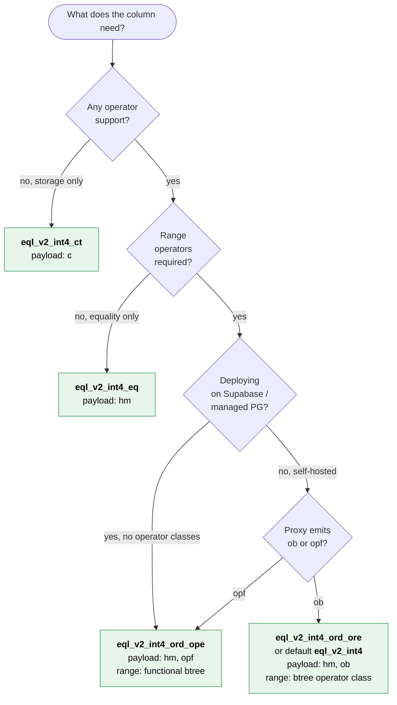
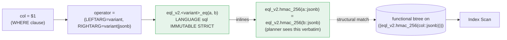
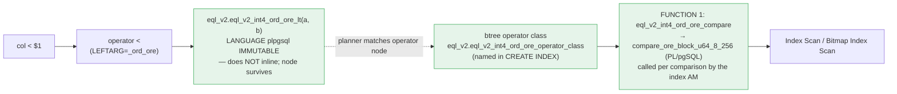

# `eql_v2_int4` variant family walkthrough

Quick-start companion to [`encrypted-int4-domain.md`](encrypted-int4-domain.md). Five `CREATE DOMAIN ... AS jsonb` declarations in `public`, one per operator/index-term combination; implementations live in `eql_v2`. Pick a variant, attach the matching functional index, write idiomatic SQL.

## Variant matrix

| Variant                      | Required payload terms | Operators                          | Equality index target                                  | Range index target                                                             |
|------------------------------|------------------------|------------------------------------|--------------------------------------------------------|--------------------------------------------------------------------------------|
| `public.eql_v2_int4_ct`      | `c`                    | none (all raise)                   | n/a                                                    | n/a                                                                            |
| `public.eql_v2_int4_eq`      | `c`, `hm`              | `=`, `<>`                          | btree `((eql_v2.hmac_256(col::jsonb)))`                | n/a (`<>` is seq-scan, btree only serves `=`)                                  |
| `public.eql_v2_int4_ord_ore` | `c`, `hm`, `ob`        | `=`, `<>`, `<`, `<=`, `>`, `>=`    | btree `((eql_v2.hmac_256(col::jsonb)))`                | btree operator class `eql_v2.eql_v2_int4_ord_ore_operator_class` (name it explicitly; excluded from Supabase build) |
| `public.eql_v2_int4_ord_ope` | `c`, `hm`, `opf`       | `=`, `<>`, `<`, `<=`, `>`, `>=`    | btree `((eql_v2.hmac_256(col::jsonb)))`                | btree `((eql_v2.eql_v2_int4_ord_ope_ope_key(col::jsonb)))`                     |
| `public.eql_v2_int4`         | `c`, `hm`, `ob`        | identical to `_ord_ore`            | identical to `_ord_ore`                                | identical to `_ord_ore`                                                        |

All five raise on `~~`, `~~*`, `@>`, `<@`, `->`, `->>` — int4 is scalar; jsonb path / containment / LIKE never apply.

## Payload shapes

```jsonb
// eql_v2_int4_ct (storage only)
{
  "v": 2,                       // EQL payload schema version
  "k": "ct",                    // kind: ciphertext
  "i": { "t": "users", "c": "age" },  // identifier (table, column)
  "c": "<ciphertext>"           // random-IV ciphertext (changes per encryption)
}

// eql_v2_int4_eq (HMAC equality)
{
  "v": 2, "k": "ct", "i": {...}, "c": "<ciphertext>",
  "hm": "<32-byte hex>"         // deterministic HMAC-SHA-256 of plaintext
}

// eql_v2_int4_ord_ore (and default eql_v2_int4): HMAC + ORE blocks
{
  "v": 2, "k": "ct", "i": {...}, "c": "<ciphertext>",
  "hm": "<32-byte hex>",
  "ob": [                       // 8-block ORE ciphertext, lex order on bytes
    "<block-0>", "<block-1>", "<block-2>", "<block-3>",
    "<block-4>", "<block-5>", "<block-6>", "<block-7>"
  ]
}

// eql_v2_int4_ord_ope: HMAC + OPE bytes
{
  "v": 2, "k": "ct", "i": {...}, "c": "<ciphertext>",
  "hm": "<32-byte hex>",
  "opf": "<65-byte hex>"        // CLWW OPE ciphertext, bytea lex order ≅ plaintext order
}
```

The variant name declares which terms the Proxy must emit. The domain itself does **not** enforce term presence — mismatches surface at query time from the per-row extractor (see Failure modes below).

## Decision flowchart



Tie-breakers:
- Both `_ord_ore` and `_ord_ope` give indexed range. `_ord_ore` indexes range via a btree **operator class** (named explicitly in `CREATE INDEX`); `_ord_ope` via a **functional** btree.
- Pick `_ord_ope` for Supabase / managed Postgres: operator classes are stripped from the EQL Supabase build, so `_ord_ore` range falls back to seq-scan there. `_ord_ope`'s functional index survives.
- Pick `_ord_ore` (or the default `eql_v2_int4`) on self-hosted Postgres, especially when your Proxy emits `ob` and not `opf`.
- The default `eql_v2_int4` is a literal mirror of `_ord_ore` — same operator surface, same `eql_v2.eql_v2_int4_operator_class` range index recipe.

## Operator dispatch and inlining

PostgreSQL resolves `col <op> rhs` to a binding declared on the domain pair, calls the bound function, and — if the function meets the inline preconditions — substitutes its body into the surrounding query before the planner builds the path tree. The planner then structurally matches the inlined expression against `pg_index.indexprs` for any functional index. The three chains below are why `=` and `_ord_ope` range get indexes while `_ord_ore` range does not.

Inline preconditions enforced for every wrapper in the variant family (assert via `pg_proc`):

| `pg_proc` column | Required value     | Reason                                                     |
|------------------|--------------------|------------------------------------------------------------|
| `prolang`        | `sql`              | PL/pgSQL bodies are never inlined.                         |
| `provolatile`    | `i` (IMMUTABLE)    | `v` (VOLATILE) / `s` (STABLE) disqualify.                  |
| `proisstrict`    | `true`             | Strict matches PostgreSQL's inline-time NULL handling.     |
| `prosecdef`      | `false`            | SECURITY DEFINER disables inlining.                        |
| `proconfig`      | NULL               | Pinned `search_path` disqualifies. Asserted by the catalog test on the `INLINEABLE_DOMAIN_FUNCTIONS` allowlist. |

### `=` on every operator-bearing variant



Note: `eql_v2.hmac_256(jsonb)` itself is PL/pgSQL and does **not** inline. That doesn't matter — the index expression is exactly `hmac_256(col::jsonb)`, so the planner matches *that* sub-expression structurally without needing to descend into it.

### `<` (and `<=`, `>`, `>=`) on `eql_v2_int4_ord_ope`

```mermaid
flowchart LR
  Q["col < $1"] --> OP["operator &lt;<br/>(LEFTARG=_ord_ope)"]
  OP --> W["eql_v2.eql_v2_int4_ord_ope_lt(a, b)<br/>LANGUAGE sql IMMUTABLE STRICT"]
  W -- inlines --> M["eql_v2_int4_ord_ope_ope_key(a)<br/>&lt; eql_v2_int4_ord_ope_ope_key(b)"]
  M --> X["eql_v2.eql_v2_int4_ord_ope_ope_key(jsonb)<br/>LANGUAGE sql IMMUTABLE STRICT"]
  X -- inlines --> BODY["(eql_v2.ope_cllw_u64_65(col::jsonb)).bytes<br/>&lt; (eql_v2.ope_cllw_u64_65($1)).bytes<br/>(bytea lex-compare, built-in)"]
  BODY -. structural match .-> IDX[("functional btree on<br/>((eql_v2_int4_ord_ope_ope_key(col::jsonb))))")]
  IDX --> PLAN[Index Scan]

  classDef inline fill:#e6f4ea,stroke:#34a853;
  class W,X,M,BODY inline;
```



Two layers of SQL+IMMUTABLE inline into the call site, terminating at a bytea built-in comparator. `ope_cllw_u64_65(jsonb)` is itself PL/pgSQL (it does the `RAISE` on missing `opf`), but again the planner's structural match against the index expression terminates at `eql_v2_int4_ord_ope_ope_key(col::jsonb)` — no further descent needed.

### `<` (and `<=`, `>`, `>=`) on `eql_v2_int4_ord_ore`

`_ord_ore` range does **not** use the inlining mechanism — it uses a btree **operator class**. The range wrappers are `LANGUAGE plpgsql IMMUTABLE` precisely so they do *not* inline: a non-inlinable operator function keeps the `<` operator node intact in the parse tree, and the planner matches that node against the operator class on the index. The index access method then calls the opclass support comparator directly, per comparison — inlining is irrelevant to it.



Mirrors how the core `eql_v2_encrypted` type indexes ORE (`src/operators/operator_class.sql`). The operator class **must be named explicitly** in `CREATE INDEX` — see Index recipes below. A *functional* index on `eql_v2.ore_block_u64_8_256(col::jsonb)` would never engage (the wrapper can't inline to a planner-visible extractor); the operator class is the supported path. On Supabase the operator class is unavailable (build-stripped) and range falls back to seq-scan — use `_ord_ope` there.

### Summary: where each chain terminates

| Variant     | Operator                        | Index path                                                      | Indexable?                       |
|-------------|---------------------------------|-----------------------------------------------------------------|----------------------------------|
| `_eq`       | `=`, `<>`                       | inlines to `hmac_256(col::jsonb) = hmac_256($1)`                | yes — hmac functional btree      |
| `_ord_ore`  | `=`, `<>`                       | inlines to `hmac_256(col::jsonb) = hmac_256($1)`                | yes — hmac functional btree      |
| `_ord_ore`  | `<`, `<=`, `>`, `>=`            | `<` operator node matched to the btree operator class           | yes — btree opclass (not Supabase) |
| `_ord_ope`  | `=`, `<>`                       | inlines to `hmac_256(col::jsonb) = hmac_256($1)`                | yes — hmac functional btree      |
| `_ord_ope`  | `<`, `<=`, `>`, `>=`            | inlines to `ope_cllw_u64_65(col::jsonb).bytes < (...).bytes`    | yes — OPE-key functional btree   |
| `_ct`       | any                             | `RAISE EXCEPTION` (PL/pgSQL)                                    | n/a — raises before scan         |

## Index recipes

### `_eq`

```sql
CREATE INDEX users_age_hmac_idx
  ON users USING btree ((eql_v2.hmac_256(age::jsonb)));
```

```
 Index Scan using users_age_hmac_idx on users  (cost=0.28..8.30 rows=1 width=…)
   Index Cond: (eql_v2.hmac_256((age)::jsonb) = eql_v2.hmac_256('{"hm":"…"}'::jsonb))
```

### `_ord_ore` / default `eql_v2_int4`

```sql
-- Equality: functional btree on the hmac extractor.
CREATE INDEX orders_amount_hmac_idx
  ON orders USING btree ((eql_v2.hmac_256(amount::jsonb)));

-- Range: btree operator class — the class MUST be named explicitly.
-- A bare USING btree (amount) resolves to jsonb_ops (the domain's
-- base type default) and will not serve ORE range.
CREATE INDEX orders_amount_ore_idx
  ON orders USING btree (amount eql_v2.eql_v2_int4_ord_ore_operator_class);
-- default eql_v2_int4: name eql_v2.eql_v2_int4_operator_class instead.
```

```
 Bitmap Heap Scan on orders
   Recheck Cond: (amount < '…'::eql_v2_int4_ord_ore)
   ->  Bitmap Index Scan on orders_amount_ore_idx
         Index Cond: (amount < '…'::eql_v2_int4_ord_ore)
```

The operator class is excluded from the EQL Supabase build; on Supabase, `_ord_ore` range falls back to seq-scan — use `_ord_ope` for indexed range there.

### `_ord_ope`

```sql
CREATE INDEX prices_hmac_idx
  ON prices USING btree ((eql_v2.hmac_256(price::jsonb)));

CREATE INDEX prices_ope_idx
  ON prices USING btree ((eql_v2.eql_v2_int4_ord_ope_ope_key(price::jsonb)));
```

```
 Index Scan using prices_ope_idx on prices  (cost=0.28..8.30 rows=… width=…)
   Index Cond: (eql_v2.eql_v2_int4_ord_ope_ope_key((price)::jsonb)
                < eql_v2.eql_v2_int4_ord_ope_ope_key('{"opf":"…"}'::jsonb))
```

### ORDER BY (all ordered variants)

```sql
-- _ord_ore / default
SELECT * FROM orders ORDER BY eql_v2.ore_block_u64_8_256(amount::jsonb);

-- _ord_ope
SELECT * FROM prices ORDER BY eql_v2.eql_v2_int4_ord_ope_ope_key(price::jsonb);
```

`ORDER BY col` directly sorts by **native jsonb byte order**, not the operator class. See Failure modes.

## Operator shape table

Every operator-bearing variant declares **three** shapes for symmetric ops (so RHS may be a parameter bound as jsonb, e.g. from a Proxy-typed bind) and **three** asymmetric shapes for path ops:

| Operator        | Shapes per variant                                                                         | Notes                                              |
|-----------------|---------------------------------------------------------------------------------------------|----------------------------------------------------|
| `=`, `<>`       | `(domain, domain)`, `(domain, jsonb)`, `(jsonb, domain)`                                    | `RESTRICT = eqsel`, `JOIN = eqjoinsel`             |
| `<`, `<=`       | `(domain, domain)`, `(domain, jsonb)`, `(jsonb, domain)`                                    | `RESTRICT = scalarltsel`, `JOIN = scalarltjoinsel` (symmetric-shape only) |
| `>`, `>=`       | `(domain, domain)`, `(domain, jsonb)`, `(jsonb, domain)`                                    | `RESTRICT = scalargtsel`, `JOIN = scalargtjoinsel` |
| `~~`, `~~*`     | `(domain, domain)`, `(domain, jsonb)`, `(jsonb, domain)`                                    | always blockers on int4                            |
| `@>`, `<@`      | `(domain, domain)`, `(domain, jsonb)`, `(jsonb, domain)`                                    | always blockers on int4                            |
| `->`            | `(domain, text)`, `(domain, integer)`, `(jsonb, domain)`                                    | always blockers on int4                            |
| `->>`           | `(domain, text)`, `(domain, integer)`, `(jsonb, domain)`                                    | always blockers on int4                            |

The `(jsonb, …)` and `(…, jsonb)` shapes exist so the binding survives a literal or bound parameter that arrives as jsonb (e.g. `WHERE col = $1::jsonb`). Without them, the planner falls back to implicit cast, which on a domain-as-jsonb produces `operator does not exist` rather than your variant-specific blocker — and that's the failure mode the variant policy is designed to prevent.

`_ct` declares blockers for every shape of every operator (the same matrix as above, all PL/pgSQL bodies that raise).

## Failure modes

- **Wrong variant for payload.** `_ord_ope` over a row whose payload omits `opf` raises per-row from the extractor:
  ```
  ERROR: Expected a ope_cllw_u64_65 index (opf) value in json: {"v":2,"k":"ct","i":{…},"c":"…","hm":"…"}
  ```
  Source: [`src/ope_cllw_u64_65/functions.sql:23`](../../src/ope_cllw_u64_65/functions.sql#L23). Same pattern for `hmac_256` (`hm` missing) and `ore_block_u64_8_256` (`ob` missing). Type system does not catch this — the domain is `CREATE DOMAIN ... AS jsonb` with no CHECK.

- **Unsupported operator.** Every blocker resolves to `encrypted_domain_unsupported_bool` and raises before predicate evaluation. Example for `<` on `_eq`:
  ```
  ERROR: operator < is not supported for eql_v2_int4_eq
  ```
  Source: `eql_v2.encrypted_domain_unsupported_bool` in [`src/encrypted_domain/functions.sql`](../../src/encrypted_domain/functions.sql#L36). For `WHERE` predicates with planner-time-foldable constants this raises once at plan time; for general-case predicates it raises on the first scanned row. Either way, the error never falls through to native jsonb comparison — that's the policy.

- **`ORDER BY col` sorts by native jsonb.** Even though `_ord_ore` and the default ship a btree operator class, `ORDER BY col` requests the column type's *default* sort order — and for a domain that resolves to the base type (`jsonb_ops`), never a domain-specific class. So `ORDER BY col` follows jsonb's lexical byte comparison, *not* ORE order. Always `ORDER BY <extractor>(col::jsonb)`. See U-001 (Domain ordering footgun).

## Wrapper language: who inlines and who doesn't

Two wrapper categories, two `LANGUAGE` choices — each deliberate:

| Wrappers | `LANGUAGE` | Why |
|----------|-----------|-----|
| Equality (`_eq`/`_neq`, all variants) and `_ord_ope` range (`_lt`/`_lte`/`_gt`/`_gte`) | `sql IMMUTABLE` | Must **inline** so the planner sees `hmac_256(col::jsonb) = …` / `ope_key(col::jsonb) < …` and matches a **functional** btree. |
| `_ord_ore` / default range (`_lt`/`_lte`/`_gt`/`_gte`) | `plpgsql IMMUTABLE` | Must **not** inline — the `<` operator node has to survive so the planner can match it against the btree **operator class**. `IMMUTABLE` (not the plpgsql default `VOLATILE`) is required or the planner won't use the index. |
| Blockers (`~~`, `@>`, `->`, … on every variant) | `plpgsql` | Must not inline; raise a variant-specific error. |

Confirm with `pg_proc` — the equality + `_ord_ope`-range wrappers:

```sql
SELECT p.proname, l.lanname AS language, p.provolatile AS vol
FROM pg_proc p JOIN pg_language l ON l.oid = p.prolang
WHERE p.pronamespace = 'eql_v2'::regnamespace
  AND p.proname IN (
    'eql_v2_int4_eq', 'eql_v2_int4_neq',
    'eql_v2_int4_eq_eq', 'eql_v2_int4_eq_neq',
    'eql_v2_int4_ord_ore_eq', 'eql_v2_int4_ord_ore_neq',
    'eql_v2_int4_ord_ope_eq', 'eql_v2_int4_ord_ope_neq',
    'eql_v2_int4_ord_ope_lt', 'eql_v2_int4_ord_ope_lte',
    'eql_v2_int4_ord_ope_gt', 'eql_v2_int4_ord_ope_gte',
    'eql_v2_int4_ord_ope_ope_key')
ORDER BY p.proname;
```

Every row: `language=sql`, `vol=i`. The `_ord_ore` / default range wrappers, by contrast, are `language=plpgsql`, `vol=i` — non-inlinable but immutable, as the operator-class path requires.

## Pointers

- Reference: [`docs/reference/encrypted-int4-domain.md`](encrypted-int4-domain.md)
- Migration & U-001: [`docs/upgrading/v2.4.md`](../upgrading/v2.4.md)
- Per-variant SQL: [`src/encrypted_domain/int4/`](../../src/encrypted_domain/int4/)
- Extractor / comparator implementations: [`src/ope_cllw_u64_65/functions.sql`](../../src/ope_cllw_u64_65/functions.sql), [`src/ore_block_u64_8_256/compare.sql`](../../src/ore_block_u64_8_256/compare.sql)
- Inlineability allowlist: [`tasks/pin_search_path.sql`](../../tasks/pin_search_path.sql)
