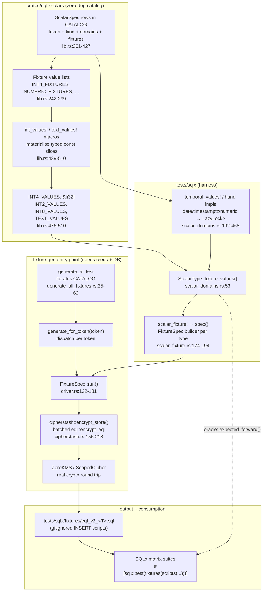
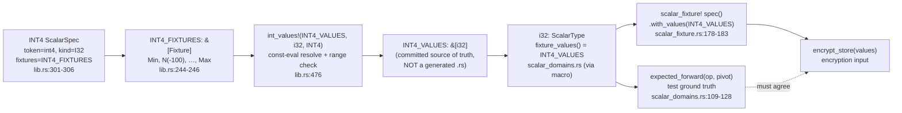

# Fixture Generator Walkthrough

How EQL's SQLx test suite gets its encrypted test data: plaintext values declared
once in a Rust catalog, encrypted through **real** CipherStash crypto, and emitted
as gitignored SQL `INSERT` scripts the test matrix loads.

> Scope: the **fixture / value** side of the system — where plaintext values come
> from, how they are encrypted, and what SQL is produced. The sibling SQL code
> generator (`eql-codegen`, which renders the `eql_v3.*` domain functions and
> operators) consumes the same `eql-scalars::CATALOG` but is documented elsewhere.

---

## 1. Why this exists: real ciphertexts, never synthetic blobs

EQL is searchable encryption. Its correctness claims (`WHERE col = $1` engages an
HMAC index; `WHERE col < $1` engages an ORE comparator) are only meaningful if the
tests run against ciphertexts produced by the *actual* crypto. Hand-curated or
synthetic JSONB blobs would silently diverge from what `cipherstash-client`
actually emits, hiding real bugs.

The project `CLAUDE.md` states this as a hard requirement:

> EQL is searchable encryption; tests MUST use real ciphertexts/index terms from
> the actual crypto, never hand-curated or synthetic blobs. Fixtures are
> **generated** by encrypting plaintext through cipherstash-client.

Consequences that shape the whole pipeline:

- The generator needs live CipherStash credentials (two pairs, not alternatives):
  - `CS_CLIENT_ACCESS_KEY` + `CS_WORKSPACE_CRN` — ZeroKMS auth, via `AutoStrategy`.
  - `CS_CLIENT_ID` + `CS_CLIENT_KEY` — client key material, via `EnvKeyProvider`.
  (`tasks/fixtures.toml:12-17`; built in `tests/sqlx/src/fixtures/cipherstash.rs:44-53`.)
- Generated fixture SQL is **gitignored** and regenerated on every test run
  (`.gitignore:225-230`), so a stale fixture cannot rot in the tree.
- Static/committed fixtures are forbidden as a way to dodge the creds dependency.
  There is exactly **one** committed exception, `tests/sqlx/fixtures/v3_ste_vec.sql`,
  pending a SteVec-document generator — a gap, not a pattern to copy.

The plaintext **values** are single-sourced in the Rust catalog
`crates/eql-scalars` so the test oracle (the expected-result computation) and the
encrypted fixture can never drift apart — they are derived from the same `CATALOG`
row.

---

## 2. End-to-end pipeline



Step by step:

1. **`mise run test:sqlx:prep`** (`mise.toml:49-80`) builds EQL, copies it into the
   SQLx migrations, runs `sqlx migrate run`, then calls `mise run fixture:generate:all`.
2. **`fixture:generate:all`** (`tasks/fixtures.toml:1-29`) runs the gated test:
   `cargo test --features fixture-gen --test generate_all_fixtures generate_all -- --ignored --exact --nocapture`.
3. **`generate_all`** (`generate_all_fixtures.rs:25-62`) iterates `eql_scalars::CATALOG`,
   calling `generate_for_token(spec.token)` for each scalar, then generates the three
   hand-written non-catalog `v3_*` fixtures.
4. Each token resolves to `fixtures::eql_v2_<T>::spec().run()` via the generated
   dispatch (`scalar_types!(fixture_dispatch)`).
5. **`FixtureSpec::run()`** (`driver.rs:122-181`) opens a direct Postgres connection,
   creates a transient working table, batch-encrypts every plaintext via
   `cipherstash-client`, inserts the ciphertexts as `jsonb`, renders them as committed
   `INSERT` statements with server-side `format('%L', ...)` escaping, drops the working
   table, and writes `tests/sqlx/fixtures/<name>.sql`.
6. The SQLx suites load those scripts with `#[sqlx::test(fixtures(scripts("eql_v2_int4")))]`
   and compare query results against the Rust oracle (`expected_forward`, which iterates
   the **same** `fixture_values()`).

---

## 3. CATALOG values → macro → consumers



The key invariant: the **oracle** (`expected_forward` filtering `fixture_values()`)
and the **encryption input** (`spec().values()` fed to `encrypt_store`) are the same
`&[i32]` const. The catalog comment makes this explicit (`lib.rs:429-435`):

> This is the **single-sourced** plaintext list the SQLx test matrix reads via
> `ScalarType::fixture_values()` and the fixture generator encrypts — derived from
> the same `CATALOG` row that drives SQL generation, so the oracle cannot drift
> from the fixture.

### Value materialization is per-kind

| Kind | Catalog literal | Materialized via | Result type |
|------|-----------------|------------------|-------------|
| integers (`int4`/`int2`/`int8`) | `Fixture::Int` / `Min`/`Max`/`Zero` | `int_values!` macro, **`const`** (`lib.rs:439-478`) | `&'static [iN]` |
| `text` | `Fixture::Text(&str)` | `text_values!` macro, **`const`** (`lib.rs:486-510`) | `&'static [&str]` |
| `date` / `timestamptz` | `Fixture::Date`/`Timestamptz(&str)` | `temporal_values!` → `LazyLock<Vec<T>>` (`scalar_domains.rs:192-320`) | `&'static [chrono::…]` |
| `numeric` | `Fixture::Numeric(&str)` | hand-written `LazyLock<Vec<Decimal>>` (`scalar_domains.rs:449-468`) | `&'static [Decimal]` |

Integers and text can be `const` slices; chrono and `rust_decimal` constructors
are not `const`, so those parse the catalog strings once into a `LazyLock<Vec<T>>`.
The catalog itself stays **zero-dep** (no chrono, no rust_decimal) — parsing happens
in the harness, not in `eql-scalars`. The `int_values!` macro does a compile-time
range check so an out-of-range literal is a build error, not a silent `as` truncation
(`lib.rs:456-462`).

---

## 4. Worked example: `int4` from catalog row to SQL INSERT

### 4a. The catalog row and value list

`crates/eql-scalars/src/lib.rs:244-246`:

```rust
const INT4_FIXTURES: &[Fixture] = fixtures!(int i32;
    Min, N(-100), N(-1), Zero, N(1), N(2), N(5), N(10), N(17), N(25),
    N(42), N(50), N(100), N(250), N(1000), N(9999), Max);
```

`lib.rs:301-306`:

```rust
const INT4: ScalarSpec = ScalarSpec {
    token: "int4",
    kind: ScalarKind::I32,
    domains: ORDERED_INT_DOMAINS,
    fixtures: INT4_FIXTURES,
};
```

The `fixtures!` macro range-checks every `N(..)` literal against `i32` at its
definition site (`lib.rs:191-193`), and `Min`/`Max`/`Zero` are resolved to the
kind's bounds.

### 4b. Materialized into a typed const

`lib.rs:476`:

```rust
int_values!(INT4_VALUES, i32, INT4);
```

The macro (`lib.rs:439-474`) walks `INT4.fixtures`, calls `numeric_value(kind)` to
resolve each `Fixture` (`Min` → `i32::MIN`, `N(-100)` → `-100`, `Zero` → `0`, …), and
const-evaluates the whole thing into `pub const INT4_VALUES: &[i32]`. So
`INT4_VALUES == [-2147483648, -100, -1, 0, 1, 2, 5, 10, 17, 25, 42, 50, 100, 250, 1000, 9999, 2147483647]`.

### 4c. Wired into the harness and the spec

`i32` gets its `impl ScalarType` from the `scalar_types!(scalar_type_impls)` list
(`tests/sqlx/src/scalar_types.rs:54`, `int4 => i32`), with
`fixture_values() = eql_scalars::INT4_VALUES`. The fixture module `eql_v2_int4` is
emitted by `scalar_types!(fixture_modules)` (`fixtures/mod.rs:53`), expanding the
`scalar_fixture!(int, "eql_v2_int4", i32, eql_scalars::INT4_VALUES)` builder:

`tests/sqlx/src/fixtures/scalar_fixture.rs:178-194`:

```rust
pub fn spec() -> $crate::fixtures::FixtureSpec<'static, $ty> {
    $crate::fixtures::FixtureSpec::new($name)
        $(.with_index($crate::fixtures::IndexKind::$ix))+   // Unique, Ore for int
        .with_column_type("jsonb")
        .with_values($values)                               // INT4_VALUES
}
```

`IndexKind::Unique` drives the `hm` (HMAC) equality term; `IndexKind::Ore` drives
the `ob` (ORE block) ordering term.

### 4d. Plaintext → cipherstash-client → ciphertext

`FixtureSpec::run()` calls `insert_direct` (`driver.rs:194-223`), which builds a
`ColumnConfig` and batch-encrypts:

`tests/sqlx/src/fixtures/cipherstash.rs:156-218` — `encrypt_store`:

```rust
let prepared: Vec<PreparedPlaintext> = values
    .iter()
    .map(|value| PreparedPlaintext::new(
        Cow::Borrowed(config),
        Identifier::new(table, column),   // table = "_fixture_eql_v2_int4"
        value.to_plaintext(),             // i32 → Plaintext::Int(Some(n))
        EqlOperation::Store,
    ))
    .collect();
let outputs = encrypt_eql(cipher, prepared, &opts).await?;   // ONE ZeroKMS round trip
```

`value.to_plaintext()` is the `EqlPlaintext` lift — for `i32` it is
`Plaintext::Int(Some(*self))` (`eql_plaintext.rs:152-158`). The `Cast::INT` maps to
`ColumnType::Int` (`cipherstash.rs:92-110`), and the `Unique`+`Ore` indexes map to
the unique + ORE `IndexType`s (`cipherstash.rs:118-135`). `EqlOperation::Store`
yields a full storage payload `{"k":"ct","v":2,"i":…,"c":…,"hm":…,"ob":…}`.

The cipher is built once per process (`build_cipher`, `cipherstash.rs:44-53`):
`ZeroKMSBuilder::auto()` + `EnvKeyProvider` + `ScopedCipher::init_default` — this is
where the four `CS_*` env vars are consumed.

### 4e. The rendered INSERT

The driver inserts each ciphertext into the transient `public._fixture_eql_v2_int4`
working table as plain `jsonb`, then renders committed rows with server-side literal
escaping (`spec.rs:180-190`, `render_rows_sql` using `format('%L', ...)`). The
preamble (`spec.rs:149-172`) is prepended, and the file is written to
`tests/sqlx/fixtures/eql_v2_int4.sql` (`driver.rs:176-179`).

A real generated row (from the current gitignored `eql_v2_int4.sql`, abridged) — note
`id=1` is `Min` = `-2147483648`, carrying the real `hm` HMAC term and `ob` ORE block
array:

```sql
INSERT INTO fixtures.eql_v2_int4 (id, plaintext, payload) VALUES ('1', '-2147483648',
  '{"c": "mBbK?@VVW…", "i": {"c": "payload", "t": "_fixture_eql_v2_int4"},
    "k": "ct", "v": 2,
    "hm": "f87e361e4ac3502898add25074bec82a66aa4ad563c9bb21aa89fd7b23e2a649",
    "ob": ["a1a1a1a1a1a1a1a165cecfeb3421313b…"]}'::jsonb);
```

The `plaintext` column (`-2147483648`) is the committed oracle; the `payload` is the
real encrypted document. At test time `fetch_fixture_payload` (`scalar_domains.rs:726-743`)
looks up a payload by plaintext, and `assert_scalar_plaintexts` (`scalar_domains.rs:763-778`)
compares the DB query result against `expected_forward` over `INT4_VALUES`.

---

## 5. Non-catalog `v3_*` fixtures (same pipeline, different shape)

`generate_all` also runs three hand-written fixtures that aren't `CATALOG` scalars
(`generate_all_fixtures.rs:37-61`):

- **`v3_ste_vec`** — a SteVec JSONB document fixture. **The one committed
  exception** (`.gitignore` re-lists it but `CLAUDE.md` documents it as a gap pending
  a SteVec-document generator). A hand-written `FixtureSpec<serde_json::Value>` riding
  the same `run()` pipeline.
- **`v3_doc_int4`** — a scalar-shaped SteVec document, one `{"field": <int4>}` per
  `INT4_VALUES`. A **split** fixture: the encryption input is the jsonb document but
  the plaintext oracle column is the bare `int4`, so it uses the
  `run_with_payloads` seam (`driver.rs:242-303`) instead of `run()`.
- **`v3_numeric_collision`** — the `[1, 1.0, 2]` scale-equivalence collision
  (`tests/sqlx/src/fixtures/v3_numeric_collision.rs`). It cannot live in the
  catalog `eql_v2_numeric` fixture because the catalog distinctness guard
  (`numeric_value_guards::fixtures_are_distinct_by_value`, `scalar_domains.rs:508-523`)
  forbids the value-equal pair `1`/`1.0`. Encrypted at numeric ORE width via the
  standard `.run()` driver, addressed by `id` rather than `plaintext` (since
  `WHERE plaintext = 1` would match both).

These ride the **same** `FixtureSpec` → `encrypt_store` → SQL pipeline; they are
registered directly in `fixtures/mod.rs:29-47` rather than via the `scalar_types!`
list, which only enumerates catalog scalars.

---

## 6. Credentials & the real-crypto requirement (why static is forbidden)

The generator is gated behind the `fixture-gen` cargo feature and `#[ignore]`
(`generate_all_fixtures.rs:14,26` and `scalar_fixture.rs:188-193`), so a plain
`cargo test` never compiles or runs it — and never needs credentials. It runs only
through the prep flow, which requires:

- A live Postgres with EQL installed (`mise run postgres:up`).
- **Both** CipherStash credential pairs in the environment (`tasks/fixtures.toml:12-17`):
  - `CS_CLIENT_ACCESS_KEY` + `CS_WORKSPACE_CRN` → ZeroKMS auth (`AutoStrategy`).
  - `CS_CLIENT_ID` + `CS_CLIENT_KEY` → client key (`EnvKeyProvider`).
  These are roles, not alternatives — auth and key material are separate.

Why not just commit the SQL and skip the creds? Because the ciphertexts must be the
*actual* output of the crypto. `CLAUDE.md`:

> Do NOT add static/committed fixtures to dodge the creds dependency. The one
> committed exception, `tests/sqlx/fixtures/v3_ste_vec.sql`, is a gap pending a
> SteVec-document generator … not a pattern to copy.

The gitignore enforces it mechanically (`.gitignore:225-230`): every
`eql_v2*` fixture plus `v3_doc_int4.sql` and `v3_numeric_collision.sql` are ignored
and regenerated on every `mise run test:sqlx`. A stale or hand-edited fixture can't
survive a run. The live round-trip is additionally smoke-tested by the
`#[ignore]` `live_tests` in `cipherstash.rs:309-412`, which assert the real Store
payload shape (`v=2`, non-null `hm`/`ob`/`c`/`i`) and that distinct plaintexts yield
distinct `hm` terms — so an SDK API drift surfaces there before the whole pipeline
breaks.

---

## File reference index

| Concern | Path |
|---------|------|
| Catalog rows, fixture lists, `int_values!`/`text_values!` | `crates/eql-scalars/src/lib.rs:184-510` |
| `generate_all` entry point | `tests/sqlx/tests/generate_all_fixtures.rs:25-62` |
| `fixture:generate:all` mise task | `tasks/fixtures.toml:1-29` |
| `test:sqlx:prep` flow | `mise.toml:49-80` |
| `ScalarType` trait + `fixture_values()` + oracle | `tests/sqlx/src/scalar_domains.rs:17-128` |
| `temporal_values!` (date/timestamptz), numeric/text impls | `tests/sqlx/src/scalar_domains.rs:192-468` |
| `scalar_types!` harness token list | `tests/sqlx/src/scalar_types.rs:39-63` |
| `scalar_fixture!` (spec builder + generator test) | `tests/sqlx/src/fixtures/scalar_fixture.rs` |
| `FixtureSpec` builder + SQL renderers | `tests/sqlx/src/fixtures/spec.rs` |
| `FixtureSpec::run()` / `run_with_payloads()` driver | `tests/sqlx/src/fixtures/driver.rs` |
| `encrypt_store` + `build_cipher` (cipherstash-client) | `tests/sqlx/src/fixtures/cipherstash.rs` |
| `EqlPlaintext` (`to_plaintext`, `Cast`) | `tests/sqlx/src/fixtures/eql_plaintext.rs` |
| Non-catalog fixtures | `tests/sqlx/src/fixtures/{v3_ste_vec,v3_doc_int4,v3_numeric_collision}.rs` |
| Gitignore enforcement | `.gitignore:225-230` |
