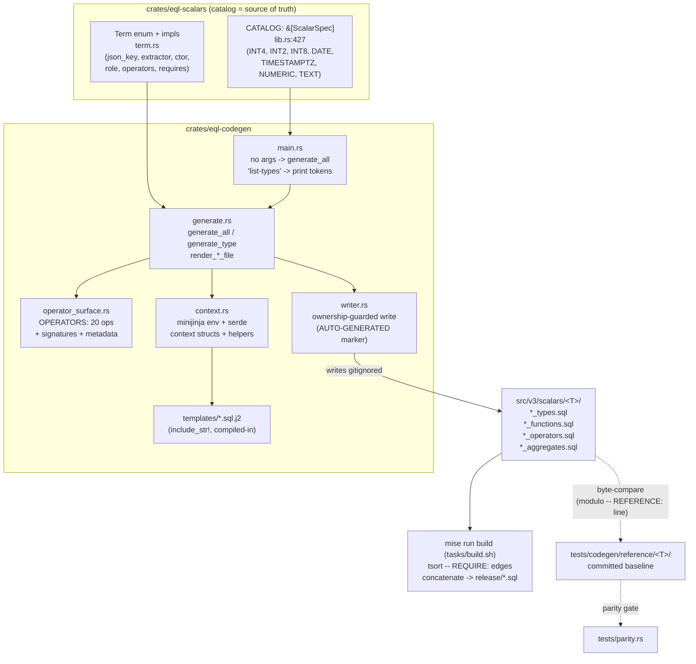
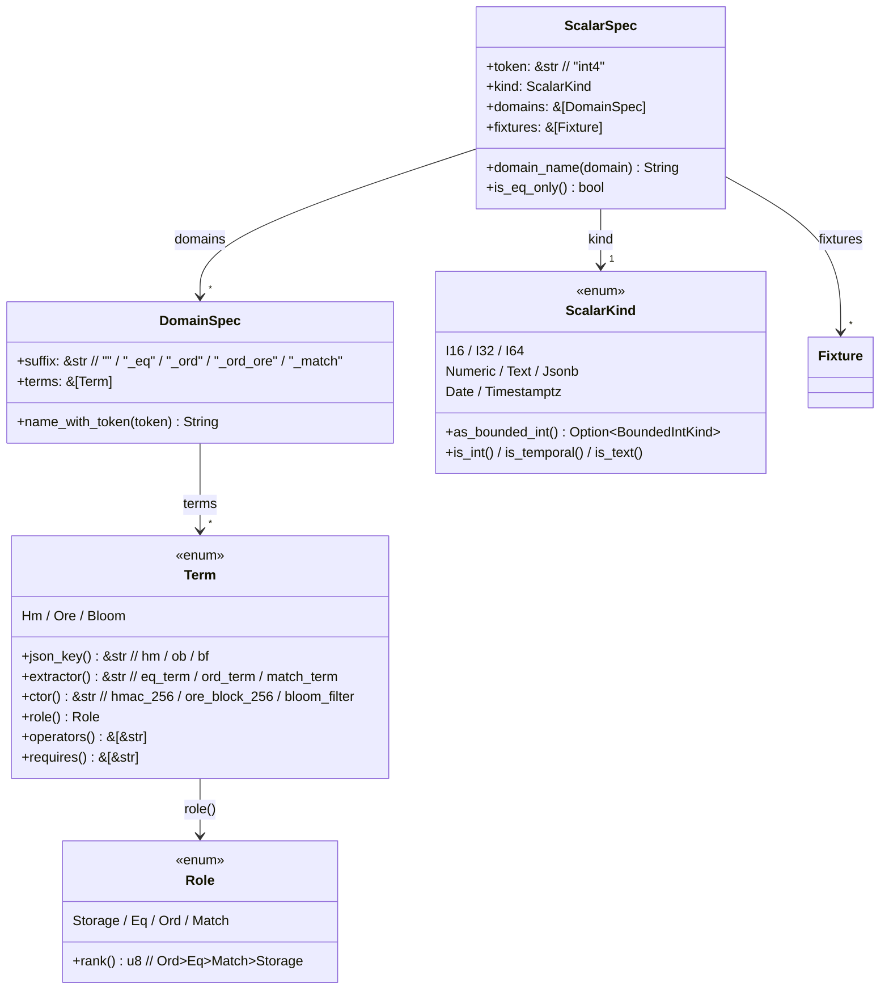

# The EQL Scalar SQL Code Generator

A walkthrough of the machinery that turns the Rust catalog (`crates/eql-scalars`) into the
generated `eql_v3` encrypted-domain SQL surface under `src/v3/scalars/<T>/`, driven by
`crates/eql-codegen`.

> Scope: this covers the **SQL generation path** only — `cargo run -p eql-codegen` (which
> `mise run build` invokes). The fixture-generation path (`generate_all_fixtures`, the
> `fixture-gen` feature) is out of scope here.

---

## 1. What it does and why it exists

EQL v3 exposes **encrypted-domain types** — jsonb-backed PostgreSQL `DOMAIN`s in the `eql_v3`
schema, one per operator/index capability (e.g. `eql_v3.int4`, `eql_v3.int4_eq`,
`eql_v3.int4_ord`, `eql_v3.int4_ord_ore`). Each domain carries:

- a `CREATE DOMAIN ... CHECK (...)` validating the encrypted JSONB envelope,
- inlinable **extractor** functions (`eq_term`, `ord_term`) projecting the index term out of
  the payload,
- inlinable **comparison wrappers** (`eq`/`neq`/`lt`/…) for the operators the domain supports,
- **blocker** functions for every native jsonb operator the domain must *not* answer
  (`->`, `@>`, `||`, …) so a domain-fallback can never silently return a wrong answer,
- `CREATE OPERATOR` bindings and (for ordered domains) `min`/`max` aggregates.

Hand-writing this surface per scalar type is repetitive and error-prone — the operator
matrix is ~20 operators × multiple signatures × multiple domains. The generator makes the
**Rust `CATALOG` the single source of truth**: one `ScalarSpec` row per type declares the
token, the native kind, the domain suffixes, and their index terms; everything else is
rendered deterministically. The generated `*_types.sql` / `*_functions.sql` / `*_operators.sql`
/ `*_aggregates.sql` files are **gitignored and never committed** — they are reproduced from
the catalog at the start of every build (`tasks/build.sh:33`).

A committed *reference* copy (with a `-- REFERENCE:` provenance line) lives under
`tests/codegen/reference/<token>/` and is byte-compared against generator output by the parity
gate (`crates/eql-codegen/tests/parity.rs`), so a renderer change that drifts from the
reviewed baseline fails CI.

---

## 2. End-to-end pipeline



The build calls `cargo run -p eql-codegen` with **no args**, which runs `generate_all(repo_root())`
(`main.rs:18-28`, `generate.rs:249`). `generate_all` iterates `eql_scalars::CATALOG` and calls
`generate_type` per row, writing into `src/v3/scalars/<token>/`. The `list-types` subcommand
(`main.rs:11-16`) prints the catalog tokens one per line — consumed by the fixtures/matrix
enumeration, not by SQL generation.

---

## 3. Core data model



Key facts, with the impl locations:

- **`ScalarSpec`** (`eql-scalars/src/lib.rs:170`) is "one row" = one scalar type. `domain_name`
  / `is_eq_only` are in `spec.rs:20,28`.
- **`DomainSpec`** (`lib.rs:161`) is one generated public domain: a `suffix` appended to the
  token plus the fixed index `terms` it carries. `name_with_token` (`spec.rs:12`) is the *single*
  place token+suffix concatenation happens, making "domain name starts with token" structural.
- **`Term`** (`lib.rs:82`) is the index-term vocabulary. Its capability methods
  (`term.rs:8-66`) are the **cross-schema SQL contract**: `Hm` → key `hm`, extractor `eq_term`,
  ctor `hmac_256`, operators `= <>`; `Ore` → key `ob`, extractor `ord_term`, ctor
  `ore_block_256`, operators `= <> < <= > >=`; `Bloom` → key `bf`, extractor `match_term`,
  operators `@> <@`. Term capabilities are fixed in code (with unit tests), not free-form data —
  an undefined term is a compile error.
- **`Role`** (`lib.rs:96`) is resolved from a domain's terms by `Term::role_for_terms`
  (`term.rs:128`) using `Role::rank` precedence. `Ore` ⇒ `Ord`, which is what gates aggregate
  generation.

The four ordered-integer domains are shared via one const (`lib.rs:203` `ORDERED_INT_DOMAINS`):
`""` (storage, no terms), `_eq` (`[Hm]`), `_ord_ore` (`[Ore]`), `_ord` (`[Ore]`). `int4`/`int2`/
`int8`/`date`/`timestamptz`/`numeric` all reuse it; `text` (`lib.rs:377` `TEXT_DOMAINS`) adds a
`_match` domain carrying `[Bloom]`. The catalog itself is `lib.rs:427`.

---

## 4. Worked example: `int4`

### 4.1 The catalog row

```rust
// crates/eql-scalars/src/lib.rs:301
const INT4: ScalarSpec = ScalarSpec {
    token: "int4",
    kind: ScalarKind::I32,
    domains: ORDERED_INT_DOMAINS,  // "", "_eq", "_ord_ore", "_ord"
    fixtures: INT4_FIXTURES,
};
```

`generate_type` (`generate.rs:206`) computes the target file set: one `int4_types.sql`, plus
`_functions.sql` + `_operators.sql` for **each** domain, plus `_aggregates.sql` only for
ord-capable domains (`is_ord_capable`, `context.rs:276`). For `int4` that's **11 files** — the
two ordered domains (`_ord`, `_ord_ore`) get aggregates; storage and `_eq` do not
(`generate.rs:213`, and the test at `generate.rs:415` asserts `written.len() == 11`).

### 4.2 `int4_types.sql` — one DO block, all four domains

`render_types_file` (`generate.rs:42`) maps each domain through `domain_block` (`context.rs:72`),
which prepends the always-present `ENVELOPE_KEYS` (`v`, `i`, `c` — `consts.rs:19`) and then the
domain's term keys (`Term::term_json_keys`, e.g. `hm` for `_eq`, `ob` for `_ord`). The
`types.sql.j2` template emits an idempotent `IF NOT EXISTS` guard per domain. Rendered
(`tests/codegen/reference/int4/int4_types.sql:30`):

```sql
CREATE DOMAIN eql_v3.int4_eq AS jsonb
  CHECK (
    jsonb_typeof(VALUE) = 'object'
    AND VALUE ? 'v'
    AND VALUE ? 'i'
    AND VALUE ? 'c'
    AND VALUE ? 'hm'        -- the Hm term's json_key
    AND VALUE->>'v' = '2'
  );
```

The `_ord`/`_ord_ore` domains are identical but with `AND VALUE ? 'ob'` (the `Ore` json_key).
Note `CREATE DOMAIN ... AS jsonb` — the base type is always `jsonb`, never another domain
(see invariant §5).

### 4.3 `int4_eq_functions.sql` — extractor + wrappers + blockers

`render_functions_file` (`generate.rs:75`) builds three kinds of `FnEntry` (`context.rs:102`):

1. **Extractor** — one per distinct extractor among the domain's terms
   (`Term::extractor_terms`). For `_eq`, the `Hm` term yields `eq_term`
   (`extractor_entry`, `context.rs:139`). Rendered via `functions/extractor.sql.j2`
   (`int4_eq_functions.sql:14`):

   ```sql
   CREATE FUNCTION eql_v3.eq_term(a eql_v3.int4_eq)
   RETURNS eql_v3.hmac_256
   LANGUAGE sql IMMUTABLE STRICT PARALLEL SAFE
   AS $$ SELECT eql_v3.hmac_256(a::jsonb) $$;
   ```

   The `RETURNS` type and the body's constructor are the *same* `SCHEMA.ctor()` name kept in
   lockstep (`context.rs:139-145`).

2. **Wrapper** — for each operator in `OPERATORS` (`operator_surface.rs:230`) that the domain's
   terms support (`Term::operators_for_terms`), and only when an extractor backs it
   (`Term::extractor_for_operator`). `_eq` supports `=` (`eq`) and `<>` (`neq`). The body casts a
   bare `jsonb` operand to the domain before extracting (`extract_arg`, `context.rs:242`).
   Rendered via `functions/wrapper.sql.j2` (`int4_eq_functions.sql:23,31`):

   ```sql
   CREATE FUNCTION eql_v3.eq(a eql_v3.int4_eq, b eql_v3.int4_eq)
   RETURNS boolean LANGUAGE sql IMMUTABLE STRICT PARALLEL SAFE
   AS $$ SELECT eql_v3.eq_term(a) = eql_v3.eq_term(b) $$;

   CREATE FUNCTION eql_v3.eq(a eql_v3.int4_eq, b jsonb)
   RETURNS boolean LANGUAGE sql IMMUTABLE STRICT PARALLEL SAFE
   AS $$ SELECT eql_v3.eq_term(a) = eql_v3.eq_term(b::eql_v3.int4_eq) $$;
   ```

3. **Unsupported (blocker)** — every operator/signature the domain does *not* support
   (`unsupported_entry`, `context.rs:178`) gets a function whose body always `RAISE`s.
   Rendered via `functions/unsupported.sql.j2`:

   ```sql
   CREATE FUNCTION eql_v3.lt(a eql_v3.int4_eq, b eql_v3.int4_eq)
   RETURNS boolean IMMUTABLE PARALLEL SAFE
   AS $$ BEGIN RAISE EXCEPTION 'operator % is not supported for %', '<', 'eql_v3.int4_eq'; END; $$
   LANGUAGE plpgsql;
   ```

   The `_eq` file has 45 `CREATE FUNCTION` (1 extractor + 4 supported wrappers + 40 blockers);
   the storage `""` file is **all 44 blockers** (no extractor, no supported operator). These
   counts are pinned by tests at `generate.rs:439,453`.

For an **ordered** domain (`int4_ord`), the same machinery produces `ord_term`
(`RETURNS eql_v3.ore_block_256`, `int4_ord_functions.sql:15`) and the six comparison wrappers
(`eq`/`neq`/`lt`/`lte`/`gt`/`gte`), e.g. `int4_ord_functions.sql:72`:

```sql
CREATE FUNCTION eql_v3.lt(a eql_v3.int4_ord, b eql_v3.int4_ord)
RETURNS boolean LANGUAGE sql IMMUTABLE STRICT PARALLEL SAFE
AS $$ SELECT eql_v3.ord_term(a) < eql_v3.ord_term(b) $$;
```

### 4.4 `int4_eq_operators.sql` — CREATE OPERATOR bindings

`render_operators_file` (`generate.rs:130`) emits a `CREATE OPERATOR` for every
operator/signature (`operator_entry`, `context.rs:210`). Planner metadata
(`COMMUTATOR`/`NEGATOR`/`RESTRICT`/`JOIN`) is emitted **only when the domain supports that
operator** — a blocker-bound operator gets the binding but no selectivity hints
(`context.rs:211-215`). The emission order is fixed and load-bearing for the byte-match
(`operator_surface.rs:42-57`). Each domain file has 44 `CREATE OPERATOR` (`generate.rs:484`).
Example (`int4_ord_operators.sql:10`):

```sql
CREATE OPERATOR = (
  FUNCTION = eql_v3.eq,
  LEFTARG = eql_v3.int4_ord, RIGHTARG = eql_v3.int4_ord,
  COMMUTATOR = =, NEGATOR = <>, RESTRICT = eqsel, JOIN = eqjoinsel
);
```

### 4.5 `int4_ord_aggregates.sql` — min/max (ord-only)

`render_aggregates_file` (`generate.rs:172`) returns `None` unless the domain `is_ord_capable`
(carries a term whose `role()` is `Role::Ord`, i.e. `Ore`). So storage and `_eq` get *no*
aggregates file; `_ord`/`_ord_ore` do (`generate.rs:490-494`). It iterates `AGGREGATE_OPS`
(`context.rs:260`: `min`/`<`, `max`/`>`) and emits a state function + `CREATE AGGREGATE` each:

```sql
CREATE FUNCTION eql_v3.min_sfunc(state eql_v3.int4_ord, value eql_v3.int4_ord)
RETURNS eql_v3.int4_ord
LANGUAGE plpgsql IMMUTABLE STRICT PARALLEL SAFE
SET search_path = pg_catalog, extensions, public
AS $$ BEGIN IF value < state THEN RETURN value; END IF; RETURN state; END; $$;
```

### 4.6 REQUIRE edges

Every generated file leads with the `-- AUTOMATICALLY GENERATED FILE.` marker followed by
`-- REQUIRE:` edges that the build's `tsort` (`tasks/build.sh`) uses to order concatenation.
`functions_requires` (`generate.rs:60`) always pulls `src/v3/schema.sql`, the type file, and the
shared blocker helper `src/v3/scalars/functions.sql`, then appends each term's `requires()` —
for `_eq` that's `src/v3/sem/hmac_256/functions.sql`, for `_ord` the two
`ore_block_256` files (`term.rs:56-65`). Visible at `int4_eq_functions.sql:3-6`.

---

## 5. Enforced invariants and footguns

The generator's renderers *structurally* enforce a set of correctness rules. These are not
style preferences — each one prevents a specific way an encrypted domain could silently leak or
return a wrong answer. Guard tests live in `generate.rs:531-603`.

### Blockers must be `LANGUAGE plpgsql`, never `LANGUAGE sql`
A blocker exists only to `RAISE`. A `LANGUAGE sql` body is **inlinable**, and the planner can
*elide* an inlined call whose result is provably unused (a dead `CASE` branch, a folded
predicate) — the `RAISE` would never run and the "operator not supported" guarantee would
silently evaporate. `LANGUAGE plpgsql` is opaque to the planner, so the body always executes.
The `unsupported.sql.j2` template hard-codes `LANGUAGE plpgsql` (template line 8); the test
`blockers_are_never_strict_and_always_plpgsql` (`generate.rs:531`) asserts
`CREATE FUNCTION count == LANGUAGE plpgsql count` in the all-blocker storage file.

### Blockers must never be `STRICT`
A `STRICT` function returns `NULL` on any `NULL` argument **without running its body** — which
would bypass the `RAISE` entirely on a `NULL` input. The blocker template emits
`IMMUTABLE PARALLEL SAFE` with **no `STRICT`** (template line 6); the same guard test asserts the
rendered blocker SQL contains no `STRICT`.

### Inlinable functions need `LANGUAGE sql` + single `SELECT` + `IMMUTABLE` + **no `SET`**
The extractors and comparison wrappers must inline so the planner can structurally match a bare
`WHERE col = $1` against the functional index on the extractor. Inlining requires a single-statement
SQL `SELECT`, `IMMUTABLE`, and crucially **no `SET` clause** — a pinned `search_path` disables
inlining. The `extractor.sql.j2`/`wrapper.sql.j2` templates emit exactly
`LANGUAGE sql IMMUTABLE STRICT PARALLEL SAFE` with no `SET`; the test
`inlinable_functions_have_no_set_search_path` (`generate.rs:546`) verifies no `LANGUAGE sql`
block pins `search_path`.

### Aggregate state functions are `LANGUAGE plpgsql` (the inverse)
`min_sfunc`/`max_sfunc` carry a `SET search_path` and procedural `IF` — they are deliberately
**not** inlinable (`aggregates.sql.j2:14-15`). The test
`aggregate_state_functions_are_plpgsql_not_inlinable` (`generate.rs:563`) pins this.

### No domain-over-domain
Every domain is `CREATE DOMAIN eql_v3.<name> AS jsonb` (`types.sql.j2:15`), never
`AS <another-domain>`. Operators resolve against the *ultimate base type* (`jsonb`), so a
derived domain would not inherit the base domain's operator surface and the blockers would stop
engaging. The single base type is the fixed `jsonb` slot in the template.

### No operator class on a domain
The generator emits `CREATE OPERATOR` bindings and (for indexing) relies on a functional index
over the extractor (`eq_term`/`ord_term`), whose **return type** (`eql_v3.hmac_256` /
`eql_v3.ore_block_256`) already carries a default opclass. No `CREATE OPERATOR CLASS` is
generated for the domain itself.

### Operators are bound even when unsupported
`render_operators_file` emits a `CREATE OPERATOR` for *every* operator on *every* domain, but
only attaches planner metadata when supported (`context.rs:210`). The binding ensures the
operator resolves to the blocker (which raises) rather than falling through to a native jsonb
operator that would silently compute on ciphertext.

### Doxygen tags survive
Each generated function/aggregate keeps `@brief`/`@param`/`@return` tags (templates) — the test
`generated_function_like_docs_keep_required_tags` (`generate.rs:580`) asserts one `@return` per
`CREATE FUNCTION`/`CREATE AGGREGATE`, so `mise run docs:validate` stays green.

---

## 6. Determinism and the AUTO-GENERATED marker

**Determinism.** An identical `CATALOG` produces **byte-identical** SQL. The generator iterates
ordered `&[...]` slices everywhere (`CATALOG`, `domains`, `OPERATORS`, `AGGREGATE_OPS`) — no
`HashMap`/`HashSet` iteration leaks into a renderer. `Term` dedupe is order-preserving
(`term.rs:69` `dedupe_preserving_order`, first occurrence wins). The
`generate_all_is_deterministic_across_runs` test (`parity.rs:136`) runs the generator twice into
separate temp dirs and byte-compares every file. minijinja keeps each template's trailing
newline (`context.rs:14` `set_keep_trailing_newline(true)`) so the output ends in exactly one.

**The AUTO-GENERATED marker.** Every generated file's first line is
`-- AUTOMATICALLY GENERATED FILE.` (`consts.rs:7` `AUTO_GENERATED_MARKER`, emitted by each
template as line 1). It serves three roles:

1. **Ownership / clobber safety.** `writer.rs` only overwrites or cleans files whose first line
   is the marker (`is_generated`, `writer.rs:36`; `clean_generated_files`, `writer.rs:42`;
   `ensure_generated_paths_writable`, `writer.rs:63`). A hand-written file (e.g.
   `<T>_extensions.sql`, which has no marker) is never clobbered — the run errors out instead.
   `write_generated_file` (`writer.rs:80`) *re-validates* the marker on the rendered body before
   writing, so a renderer bug that dropped the marker can't produce an unowned file.
2. **Doc-validation skip.** `tasks/docs/validate/*.sh` grep this marker to skip generated SQL
   (`consts.rs:32` test pins the marker to the grep).
3. **Parity baseline.** The committed reference files under `tests/codegen/reference/<token>/`
   carry one extra `-- REFERENCE:` provenance line *above* the marker; the parity gate strips it
   and byte-compares the rest (`parity.rs:71` `reference_body`). `reference_dirs_match_catalog_tokens`
   (`parity.rs:78`) ensures the reference dir set equals the catalog token set — a new catalog
   type with no reference, or a stale reference with no catalog row, fails CI.

---

## 7. Where to look

| Concern | File |
| --- | --- |
| Catalog rows / `CATALOG` | `crates/eql-scalars/src/lib.rs:301-427` |
| `ScalarSpec` / `DomainSpec` defs + impls | `crates/eql-scalars/src/lib.rs:160-176`, `spec.rs` |
| `Term` capability contract | `crates/eql-scalars/src/term.rs` |
| `ScalarKind` / `Role` | `crates/eql-scalars/src/kind.rs`, `lib.rs:96-130` |
| Entry point / `list-types` | `crates/eql-codegen/src/main.rs` |
| Orchestrator + render functions | `crates/eql-codegen/src/generate.rs` |
| minijinja env + serde context | `crates/eql-codegen/src/context.rs` |
| Operator surface (20 ops) | `crates/eql-codegen/src/operator_surface.rs` |
| Marker + schema + escaping | `crates/eql-codegen/src/consts.rs` |
| Ownership-guarded writer | `crates/eql-codegen/src/writer.rs` |
| Templates | `crates/eql-codegen/templates/*.sql.j2` |
| Parity gate | `crates/eql-codegen/tests/parity.rs` |
| Committed reference baseline | `tests/codegen/reference/<token>/` |
| Build wiring | `tasks/build.sh:33` |
